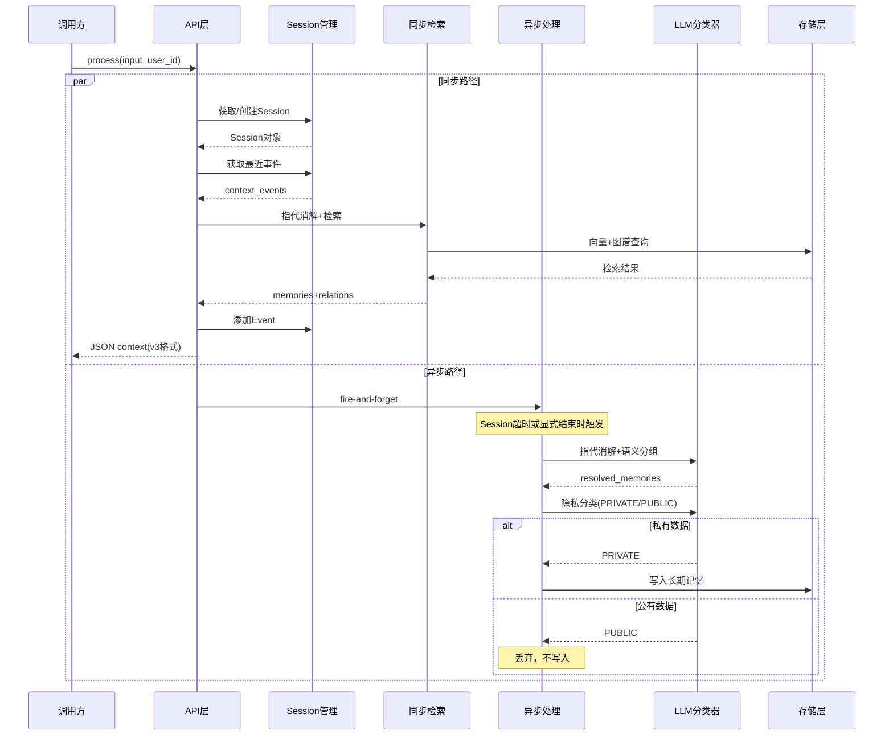

# NeuroMemory 主架构文档

> **状态**: 生产级服务
> **最后更新**: 2026-01-24

---

## 文档导航

| 文档 | 说明 |
|------|------|
| **本文档** | 系统概述、架构设计、项目目标 |
| [工作原理](HOW_IT_WORKS.md) | 场景演示、数据流、多跳推理详解 |
| [快速开始](GETTING_STARTED.md) | 环境搭建、安装运行 |
| [配置参考](CONFIGURATION.md) | 环境变量、模型切换、数据库配置 |
| [接口设计](API.md) | REST API、CLI |
| [数据模型](DATA_MODEL.md) | 向量存储、图谱存储、用户隔离 |
| [核心组件](COMPONENTS.md) | 配置模块、认知引擎、Mem0 集成 |
| [Mem0 深度解析](MEM0_DEEP_DIVE.md) | Mem0 框架原理、API 详解、价值分析 |
| [测试指南](TESTING.md) | pytest 测试套件、运行方法、测试示例 |
| [部署架构](DEPLOYMENT.md) | 本地开发、生产部署 |
| [部署问题排查](DEPLOYMENT_TROUBLESHOOTING.md) | Neo4j 密码、健康检查、常见问题 |
| [可观测性](OBSERVABILITY.md) | Metrics、Tracing、Logging |
| [技术决策](ADR.md) | 架构决策记录 (ADR) |
| [Session 记忆管理](SESSION_MEMORY_DESIGN.md) | Session 管理设计文档 |

---

## 目录

1. [实现状态总览](#1-实现状态总览)
2. [系统概述](#2-系统概述)
3. [设计目标与约束](#3-设计目标与约束)
4. [架构概览](#4-架构概览)
5. [未来扩展 (TODO)](#5-未来扩展-todo)
6. [附录](#6-附录)

---

## 1. 实现状态总览

### 1.1 组件实现状态矩阵

| 组件 | 状态 | 说明 |
|------|------|------|
| **存储层** | | |
| ├─ Neo4j 图谱存储 | ✅ 已实现 | 通过 Mem0 集成，支持实体关系存储 |
| ├─ Qdrant 向量存储 | ✅ 已实现 | 通过 Mem0 集成，支持语义检索 |
| └─ 情景存储 (Episodic) | 📋 规划 | 暂不实现，作为未来扩展 |
| **集成层** | | |
| └─ Mem0 Framework | ✅ 已实现 | 混合存储、实体提取、检索融合 |
| **服务层** | | |
| ├─ 意图判断 (IntentClassifier) | ✅ 已实现 | LLM 判断 personal/factual/general 意图 |
| ├─ 代词消解 (CoreferenceResolver) | ✅ 已实现 | 用户身份提取 + "我"→用户名替换 |
| ├─ 混合检索 (HybridRetriever) | ✅ 已实现 | 通过 brain.search() |
| ├─ 图谱关系处理 (RelationProcessor) | ✅ 已实现 | 关系归一化 + 去重 |
| ├─ 深度推理 (ReasoningCore) | ✅ 已实现 | 通过 LLM invoke |
| └─ 异步记忆整合 (AsyncConsolidator) | ✅ 已实现 | ThreadPoolExecutor 后台异步执行 |
| **接入层** | | |
| ├─ REST API (FastAPI) | ✅ 已实现 | 支持 /process、/graph、/end-session 等端点 |
| ├─ CLI 工具 (Typer) | ✅ 已实现 | neuromemory 命令，支持 status/add/search/ask/graph |
| └─ MCP Server | ✅ 已实现 | 支持 Cursor IDE、Claude Desktop 集成 |
| **新功能** | | |
| ├─ Session 管理 | ✅ 已实现 | 内部自动管理短期记忆，超时自动整合 |
| ├─ 指代消解 | ✅ 已实现 | 检索时规则匹配，整合时 LLM 消解 |
| ├─ Session 整合器 | ✅ 已实现 | 语义分组 + 隐私过滤 + 长期存储 |
| └─ 隐私过滤器 | ✅ 已实现 | LLM 分类 PRIVATE/PUBLIC，只存储私有数据 |
| **可观测性** | | |
| ├─ Metrics (Prometheus) | 📋 规划 | 业务指标 + 系统指标 |
| ├─ Tracing (Jaeger) | 📋 规划 | 分布式链路追踪 |
| └─ Logging (结构化) | ✅ 已实现 | 后台整合日志记录器 |
| **认知编排** | | |
| ├─ 线性流程 | ✅ 已实现 | 预处理 → 意图判断 → 检索 → 推理 → 异步整合 |
| └─ LangGraph 复杂编排 | 📋 规划 | 条件分支、循环推理等 |

**图例**: ✅ 已实现 | 🚧 开发中 | 📋 规划

### 1.2 功能完成度

```
核心功能 (Core)           [██████████] 100%
├─ 混合记忆存储            [██████████] 100%
├─ 混合检索                [██████████] 100%
├─ LLM 推理                [██████████] 100%
├─ 模型切换                [██████████] 100%
├─ 用户隔离                [██████████] 100%
├─ 意图判断                [██████████] 100%
├─ 代词消解                [██████████] 100%
├─ 异步记忆整合            [██████████] 100%
├─ Session 管理            [██████████] 100%
├─ 指代消解（LLM）          [██████████] 100%
└─ 隐私过滤                [██████████] 100%

接入层 (Access)           [██████████] 100%
├─ REST API                [██████████] 100%
├─ CLI 工具                [██████████] 100%
└─ MCP Server              [██████████] 100%

可观测性 (Observability)  [██░░░░░░░░] 20%
├─ Metrics                 [░░░░░░░░░░] 0%
├─ Tracing                 [░░░░░░░░░░] 0%
└─ Logging                 [██████░░░░] 60%  <- 部分实现
```

---

## 2. 系统概述

### 2.1 项目背景

传统的 RAG（检索增强生成）系统采用"扁平"的向量存储方案，将记忆打散成碎片，丢失了结构和关联。虽然它能识别语义相似性（如"苹果"和"手机"向量接近），但难以推理因果关系或实体间的复杂网络。例如，纯向量方案知道"Elon Musk"和"Tesla"语义相近，但无法明确表达 `[Elon Musk] --(CEO of)--> [Tesla]` 这种硬逻辑关系。

NeuroMemory 采用**神经符号混合记忆系统 (Neuro-Symbolic Hybrid Memory)** 架构，融合知识图谱 (GraphRAG) 与高维向量 (Vector)，模拟人类海马体和大脑皮层的工作方式，实现真正的多跳推理能力。

**设计哲学：人类大脑的记忆机制**

系统设计借鉴了人类大脑的记忆分层：

| 记忆层 | 人脑对应 | 系统实现 | 解决的问题 |
|--------|----------|----------|------------|
| 关联记忆 | 海马体 | Neo4j 图谱 | 幻觉、逻辑断层 |
| 语义记忆 | 大脑皮层 | Qdrant 向量 | 模糊搜索、非结构化理解 |
| 情景流 | 工作记忆 | LLM 长窗口 | 短期上下文保持 `[📋 规划]` |


### 2.2 系统定位

NeuroMemory 是一个**生产级记忆服务**，提供：

- **REST API**: 供任意客户端远程调用（推荐）`[✅ 已实现]`
- **命令行 CLI**: 供开发者调试和管理 `[✅ 已实现]`
- **MCP Server**: 支持 Cursor IDE、Claude Desktop 集成 `[✅ 已实现]`

### 2.3 核心能力

| 能力 | 状态 | 描述 |
|------|------|------|
| **意图判断** | ✅ | LLM 自动判断用户意图类型（personal/factual/general） |
| **代词消解** | ✅ | 检索时规则匹配，整合时 LLM 消解，支持跨轮次指代 |
| **混合检索** | ✅ | 并行执行向量语义搜索和图谱关系遍历 |
| **关系归一化** | ✅ | 英文关系类型自动转换为中文，并去重 |
| **多跳推理** | ✅ | 通过图谱路径实现 `A → B → C` 的逻辑链条推理 |
| **自动知识提取** | ✅ | LLM 自动从文本中提取实体和关系 |
| **Session 管理** | ✅ | 内部自动管理短期记忆，超时自动整合为长期记忆 |
| **隐私过滤** | ✅ | LLM 分类 PRIVATE/PUBLIC，只存储私有数据 |
| **异步记忆整合** | ✅ | Session 结束时后台整合，用户无需等待 |
| **模型可切换** | ✅ | 支持 DeepSeek/Gemini 作为 LLM，Local/Gemini/SiliconFlow 作为 Embedding |
| **用户隔离** | ✅ | 基于 user_id 的数据隔离 |

### 2.3.1 隐私过滤器设计

**设计目标**：

- **只存 (Write)**: 用户个人偏好、经历、私有实体关系、个人计划（PRIVATE）
- **不存 (Discard)**: 通用事实、世界知识、公共信息、问句（PUBLIC）

**分类规则**：

| 类型 | 示例 | 处理方式 |
|------|------|----------|
| **PRIVATE** | "我喜欢苹果"、"我女儿叫灿灿"、"我明天要开会" | 存储到长期记忆 |
| **PUBLIC** | "苹果公司是乔布斯创立的"、"北京是中国的首都"、"小朱的儿子叫什么？" | 不存储，丢弃 |

**实现方式**：

使用 LLM 对每条输入进行分类，分类失败时默认按 PRIVATE 处理（宁可多存不漏存），确保用户私有数据不丢失。

**集成说明**：

隐私过滤在 Session 整合阶段执行，对 LLM 消解后的记忆片段进行分类，只存储 PRIVATE 类型的数据。

---

### 2.4 设计原理：为什么图谱优于纯向量

从计算机科学角度分析，引入知识图谱相比纯向量方案具有以下核心优势：

**1. 解决"逻辑致盲" (Logic Blindness)**

| 方案 | 处理方式 | 结果 |
|------|----------|------|
| 纯向量 | 只能找到"Demis Hassabis"和"Gemini"语义接近 | 模糊推测 |
| 图谱 + 向量 | 建立路径 `(Demis)-[LEADS]->(DeepMind)-[CREATED]->(Gemini)` | 确定答案 |

当询问"Demis 和 Gemini 的关系"时，LLM 能直接"看见"图谱中的推理路径，给出明确的因果链条。

**2. 解决"信息污染" (Information Pollution)**

| 方案 | 问题 | 解决方式 |
|------|------|----------|
| 纯向量 | 记忆增多后搜索结果充满噪音 | 无法自动纠错 |
| 图谱 + 向量 | 图谱具有自我纠错能力 | 更新边属性而非新增矛盾记录 |

例如：图谱中已有 `(Project X)-[STATUS]->(Active)`，当收到"项目暂停了"时，图谱会更新边的属性，而非新增一条矛盾记录。

**3. 长期记忆演化**

这套系统不仅是"存储"数据，更是在"编织"知识网络。随着使用时间增长，Neo4j 中的图谱会越来越致密，形成一个真正的专家知识库，支撑越来越复杂的多跳推理。

---

## 3. 设计目标与约束

### 3.1 设计目标

| 目标 | 优先级 | 说明 |
|------|--------|------|
| **准确性** | P0 | 减少幻觉，提供可追溯的推理路径 |
| **可扩展性** | P0 | 支持模型、存储组件的灵活切换 |
| **可观测性** | P1 | 完整的 Metrics + Tracing + Logging `[📋 规划]` |
| **易用性** | P1 | 简洁的 API，多种接入方式 |
| **性能** | P2 | 检索延迟 < 500ms (P95) |

### 3.2 设计约束

| 约束 | 说明 |
|------|------|
| **记忆永久存储** | 不实现自动过期/遗忘机制 |
| **简单用户隔离** | 基于 user_id 参数，不含认证/授权系统 |
| **线性认知流程** | 当前采用简单的 检索→推理→整合 流程 |

### 3.3 非目标 (Out of Scope)

- 用户认证/授权系统
- 记忆自动遗忘/过期
- 分布式图数据库集群
- 实时流式处理

---

## 4. 架构概览

### 4.1 系统分层架构

```
┌─────────────────────────────────────────────────────────────────────┐
│                    接入层 (Access Layer) [✅ 已实现]                  │
│  ┌─────────────┐  ┌─────────────────────────────┐  ┌─────────────┐  │
│  │  CLI Tool   │  │  REST API (FastAPI)         │  │ MCP Server  │  │
│  │ [✅ 实现]   │  │  [✅ 实现]                  │  │ [✅ 实现]  │  │
│  └──────┬──────┘  └──────────────┬──────────────┘  └──────┬──────┘  │
│         │                        │                         │         │
│         └────────────────────────┼─────────────────────────┘         │
│                          │                                            │
│  ┌───────────────────────▼───────────────────────┐                  │
│  │         MCP Server (stdio/HTTP)                │                  │
│  │              [✅ 实现]                          │                  │
│  └───────────────────────┬───────────────────────┘                  │
└─────────┼────────────────┼────────────────────────┼─────────────────┘
          │                │                        │
          └────────────────┼────────────────────────┘
                           ▼
┌─────────────────────────────────────────────────────────────────────┐
│                       服务层 (Service Layer) [✅ 已实现]              │
│  ┌─────────────────────────────────────────────────────────────┐    │
│  │                    PrivateBrain                            │    │
│  │  ┌───────────────┐ ┌───────────────┐ ┌───────────────────┐  │    │
│  │  │HybridRetriever│ │ ReasoningCore │ │SessionConsolidator│  │    │
│  │  │   [✅ 实现]   │ │   [✅ 实现]   │ │     [✅ 实现]     │  │    │
│  │  └───────────────┘ └───────────────┘ └───────────────────┘  │    │
│  │  ┌───────────────┐ ┌───────────────┐ ┌───────────────────┐  │    │
│  │  │SessionManager │ │CoreferenceRes │ │ PrivacyFilter     │  │    │
│  │  │   [✅ 实现]   │ │   olver       │ │     [✅ 实现]     │  │    │
│  │  │               │ │   [✅ 实现]   │ │                   │  │    │
│  │  └───────────────┘ └───────────────┘ └───────────────────┘  │    │
│  └─────────────────────────────────────────────────────────────┘    │
└─────────────────────────────────────────────────────────────────────┘
                           │
                           ▼
┌─────────────────────────────────────────────────────────────────────┐
│                    集成层 (Integration Layer) [✅ 已实现]             │
│  ┌──────────────────────────────────────────────────────────────┐   │
│  │                      Mem0 Framework                          │   │
│  │   • 混合存储抽象    • 实体提取    • 检索融合                    │   │
│  └──────────────────────────────────────────────────────────────┘   │
└─────────────────────────────────────────────────────────────────────┘
                           │
          ┌────────────────┼────────────────┐
          ▼                ▼                ▼
┌─────────────────────────────────────────────────────────────────────┐
│                      存储层 (Storage Layer) [✅ 已实现]               │
│  ┌─────────────────┐  ┌─────────────────┐  ┌───────────────────┐   │
│  │   Neo4j 图谱     │  │   Qdrant 向量   │  │  情景存储          │   │
│  │   [✅ 已实现]    │  │   [✅ 已实现]   │  │  [📋 规划]        │   │
│  └─────────────────┘  └─────────────────┘  └───────────────────┘   │
└─────────────────────────────────────────────────────────────────────┘
                           │
                           ▼
┌─────────────────────────────────────────────────────────────────────┐
│                        外部依赖 (External)                           │
│  ┌─────────────────┐  ┌─────────────────┐  ┌───────────────────┐   │
│  │  LLM Provider   │  │Embedding Provider│ │   可观测性平台     │   │
│  │ DeepSeek/Gemini │  │ Local/Gemini/   │  │   [📋 规划]       │   │
│  │   [✅ 已实现]   │  │  SiliconFlow    │  │                   │   │
│  │                 │  │   [✅ 已实现]   │  │                   │   │
│  └─────────────────┘  └─────────────────┘  └───────────────────┘   │
└─────────────────────────────────────────────────────────────────────┘
```

> 详细组件设计参见 [核心组件](COMPONENTS.md)

### 4.1.1 接入方式说明

NeuroMemory 提供多种接入方式，满足不同场景需求：

| 接入方式 | 适用场景 | 启动命令 | 说明 |
|---------|---------|---------|------|
| **REST API** | HTTP 客户端、DIFY 工作流 | `uvicorn http_server:app --port 8765` | FastAPI 服务（推荐） |
| **CLI 工具** | 命令行调试、脚本 | `neuromemory status/add/search/ask/graph` | Typer 命令行工具 |
| **MCP Server (stdio)** | Cursor IDE、Claude Desktop | `python -m mcp_server` | 标准输入输出协议 |
| **MCP Server (HTTP)** | 自定义应用 | 通过 HTTP 调用 MCP 端点 | HTTP 传输协议 |

**MCP Server 集成**：

采用 **Anthropic MCP (Model Context Protocol)** 协议，支持两种传输方式：

- **stdio 模式**：适用于 Cursor IDE、Claude Desktop 等本地工具
- **HTTP 模式**：适用于 DIFY、自定义应用等远程调用场景

### 4.1.2 Y 型分流架构

NeuroMemory 采用 **Y 型分流架构**，用户输入被视为"刺激 (Stimulus)"，进入系统后立即分叉处理：

| 路径 | 执行方式 | 职责 | 增强说明 |
|------|----------|------|----------|
| **同步路径 (Sync Path)** | 立即执行，阻塞返回 | 检索相关记忆，返回结构化上下文 | 包含 Session 管理和指代消解 |
| **异步路径 (Async Path)** | Fire-and-forget | 隐私分类 + 记忆写入 | Session 结束时整合为长期记忆 |



**改进说明**：

- **同步路径增强**：集成 Session 管理和指代消解，检索时使用最近事件上下文
- **异步路径优化**：Session 结束时统一整合，而非每次输入都触发存储决策
- **响应格式**：包含 `resolved_query`、`memories`、`relations`

### 4.2 记忆双层架构

NeuroMemory 的核心是**双层记忆系统**（三层架构中的情景流暂未实现）：

```
┌─────────────────────────────────────────────────────────────────┐
│                     记忆系统 (Memory System)                     │
├─────────────────────────────────────────────────────────────────┤
│                                                                 │
│   ┌─────────────────────────┐   ┌─────────────────────────┐    │
│   │    关联记忆 (Graph)      │   │    语义记忆 (Vector)     │    │
│   │    ═══════════════      │   │    ═══════════════      │    │
│   │    [✅ 已实现]          │   │    [✅ 已实现]          │    │
│   │                         │   │                         │    │
│   │  存储: Neo4j            │   │  存储: Qdrant           │    │
│   │  内容: 实体 + 关系       │   │  内容: 文本 + 嵌入向量   │    │
│   │  查询: Cypher 图遍历    │   │  查询: 余弦相似度        │    │
│   │                         │   │                         │    │
│   │  优势: 精确逻辑推理     │   │  优势: 模糊语义匹配      │    │
│   │  场景: 多跳关系查询     │   │  场景: 相似内容检索      │    │
│   └─────────────────────────┘   └─────────────────────────┘    │
│                                                                 │
│                         ┌───────────┐                          │
│                         │  混合检索  │                          │
│                         │  Fusion   │                          │
│                         └─────┬─────┘                          │
│                               │                                │
│                               ▼                                │
│                    ┌───────────────────┐                       │
│                    │   统一结果集       │                       │
│                    │ [{memory, type}]  │                       │
│                    └───────────────────┘                       │
│                                                                 │
└─────────────────────────────────────────────────────────────────┘
```

> 详细数据结构参见 [数据模型](DATA_MODEL.md)

### 4.3 认知处理流程

当前流程包含 Session 管理和指代消解 `[✅ 已实现]`：

```
  用户输入 (user_input, user_id)
     │
     ▼
┌─────────────────────────────────────────────────────────────────┐
│  Phase 0: Session 管理                                           │
│  ─────────────────────────────                                  │
│    • 获取或创建 Session（内部自动管理）                           │
│    • 获取最近事件用于指代消解                                     │
└─────────────────────────────────────────────────────────────────┘
                        │
                        ▼
┌─────────────────────────────────────────────────────────────────┐
│  Phase 1: 指代消解（检索时，规则匹配）                            │
│  ─────────────────────────────────────                          │
│    • 从最近事件中提取上下文                                       │
│    • 规则匹配："这个"→名词、"她/他"→人名                          │
│    • 生成消解后的查询                                             │
└─────────────────────────────────────────────────────────────────┘
                        │
                        ▼  resolved_query
┌─────────────────────────────────────────────────────────────────┐
│  Phase 2: 混合检索 (Hybrid Retrieval)                            │
│  ─────────────────────────────────────                          │
│    向量搜索 (Qdrant) ◄──── 并行 ────► 图谱遍历 (Neo4j)          │
│                     └──────┬──────┘                             │
│                            ▼                                    │
│    ┌───────────────────────────────────────────────┐            │
│    │ 关系处理: normalize_relation_type() + 去重     │            │
│    │ 英文 → 中文映射: daughter → 女儿, son → 儿子   │            │
│    └───────────────────────────────────────────────┘            │
└─────────────────────────────────────────────────────────────────┘
                        │
                        ▼  memories + relations
┌─────────────────────────────────────────────────────────────────┐
│  Phase 3: 返回结果（立即返回）                                    │
│  ──────────────────────────────                                 │
│    返回 JSON:                                                    │
│    • resolved_query: 消解后的查询                                │
│    • memories: 语义记忆片段                                      │
│    • relations: 知识图谱关系                                      │
│    • metadata: 检索耗时、是否有记忆                               │
└─────────────────────────────────────────────────────────────────┘
                        │
                        ▼  同时执行
┌─────────────────────────────────────────────────────────────────┐
│  Phase 4: 添加事件到 Session                                     │
│  ─────────────────────────────────────                          │
│    • 创建 Event（role="user", content=原始输入）                  │
│    • 添加到 Session.events                                       │
│    • 更新 Session.last_active_at                                 │
└─────────────────────────────────────────────────────────────────┘
                        │
                        ▼  Session 超时或显式结束
┌─────────────────────────────────────────────────────────────────┐
│  Phase 5: Session 整合（后台异步）                                │
│  ──────────────────────────────────────────                     │
│    ThreadPoolExecutor.submit()                                  │
│    ┌───────────────────────────────────────────────┐            │
│    │ 1. LLM 指代消解 + 语义分组                     │            │
│    │ 2. 隐私过滤（PRIVATE/PUBLIC）                  │            │
│    │ 3. 存储 PRIVATE 数据到长期记忆                  │            │
│    │    → 实体提取 → Neo4j | 向量化 → Qdrant        │            │
│    │ 不阻塞用户，后台执行                            │            │
│    └───────────────────────────────────────────────┘            │
└─────────────────────────────────────────────────────────────────┘
```

### 4.4 性能统计示例

```
[性能统计] 用户感知耗时: 10.24s
  - 预处理(身份+消解): 0.00s (0.0%)
  - 意图判断(LLM): 3.77s (36.8%)
  - 混合检索(Vector+Graph): 1.85s (18.1%)
  - 深度推理(LLM): 4.62s (45.1%)
  - 记忆整合: 异步执行中（约 28s，不阻塞用户）
```

---

## 5. 未来扩展 (TODO)

### 5.1 情景流 (Episodic Stream)

**优先级**: P2 | **状态**: 📋 规划

- 目标: 利用 LLM 长窗口保留完整对话历史作为"短期工作记忆"
- 设计方向:
  - 使用 Gemini 1.5/2.0 Pro 的超长窗口 (1M-2M tokens)
  - 保留最近数周的完整对话原文
  - 与 Graph/Vector 层融合的三层检索策略

### 5.2 LangGraph 复杂编排

**优先级**: P2 | **状态**: 📋 规划

- 当前: 简单线性流程 (检索 → 推理 → 整合)
- 扩展方向:
  - 多轮迭代检索 (检索不足时自动扩展查询)
  - 并行推理分支 (不同假设的并行验证)
  - 条件分支 (根据问题类型选择不同策略)
  - 自我反思循环 (答案质量自检)

### 5.3 其他扩展点

| 扩展项 | 优先级 | 状态 | 说明 |
|--------|--------|------|------|
| REST API | P0 | ✅ 已完成 | FastAPI 实现，支持远程调用（主要接口） |
| CLI 工具 | P2 | ✅ 已完成 | Typer 实现，支持 status/add/search/ask/graph |
| MCP Server | P1 | ✅ 已完成 | 支持 Cursor IDE、Claude Desktop 集成 |
| Session 管理 | P0 | ✅ 已完成 | 内部自动管理，超时自动整合 |
| 可观测性 | P1 | 📋 规划 | Metrics + Tracing + Logging |
| 图谱可视化 | P2 | 📋 规划 | Web UI 展示知识图谱 |
| 批量导入 | P2 | 📋 规划 | 支持文档批量解析和导入 |
| 记忆遗忘机制 | P3 | 📋 规划 | 基于访问频率/时间的智能遗忘 |
| 多模态记忆 | P3 | 📋 规划 | 支持图片/音频等多模态内容 |
| 分布式部署 | P3 | 📋 规划 | Neo4j 集群 + Qdrant 分片 |

---

## 6. 附录

### A. 术语表

| 术语 | 定义 |
|------|------|
| 神经符号混合 (Neuro-Symbolic) | 结合神经网络（向量）和符号系统（图谱）的 AI 架构 |
| 多跳推理 (Multi-hop Reasoning) | 通过多个中间实体推导最终答案的推理能力 |
| 混合检索 (Hybrid Retrieval) | 同时使用向量搜索和图谱遍历的检索策略 |
| 记忆整合 (Consolidation) | 将新信息融入长期记忆的过程 |

### B. 参考资料

- [Mem0 Documentation](https://docs.mem0.ai/)
- [Neo4j Graph Database](https://neo4j.com/docs/)
- [Qdrant Vector Database](https://qdrant.tech/documentation/)
- [LangChain Documentation](https://python.langchain.com/)

---

*文档结束*
