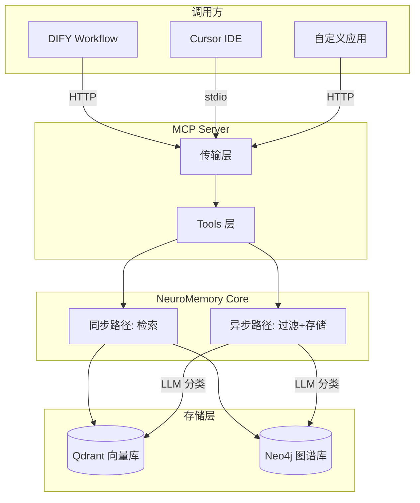
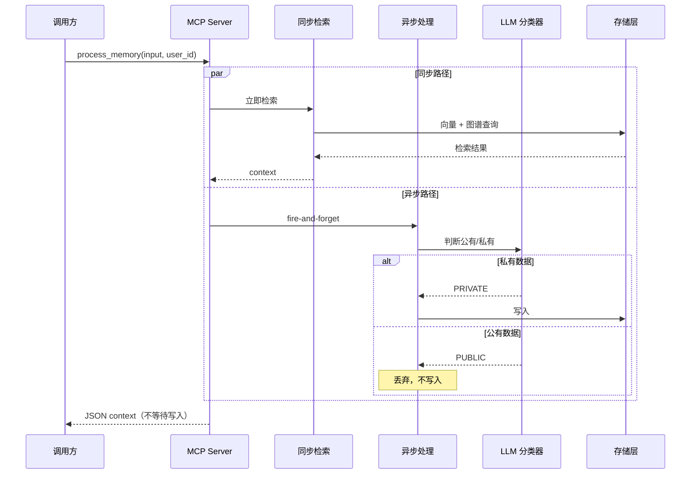

# NeuroMemory v2.0 架构设计

> 返回 [当前架构文档 (v1.x)](ARCHITECTURE.md)
>
> **版本**: v2.0  
> **最后更新**: 2026-01-22  
> **状态**: 设计文档，尚未实现

---

## 1. 项目定位与核心目标

将原有的 NeuroMemory 对话机器人重构为**纯后端的"外挂大脑"服务 (Memory-as-a-Service)**。

| 维度 | 说明 |
|------|------|
| **角色转变** | 从"像人一样聊天"转变为"像海马体一样仅负责记忆与提取" |
| **核心价值** | 为主流程 LLM 提供高密度的私有上下文，利用图谱推理能力解决 RAG 的逻辑断层，同时严格过滤通用噪音 |

---

## 2. 系统架构

### 2.1 整体架构图



### 2.2 Y 型分流架构

用户输入被视为"刺激 (Stimulus)"，进入系统后立即分叉处理：

| 路径 | 执行方式 | 职责 |
|------|----------|------|
| **同步路径 (Sync Path)** | 立即执行，阻塞返回 | 检索相关记忆，返回结构化上下文 |
| **异步路径 (Async Path)** | Fire-and-forget | 隐私分类 + 记忆写入 |



---

## 3. 接口设计 (MCP Tools)

### 3.1 集成方式

采用 **Anthropic MCP (Model Context Protocol)** 协议，支持两种传输方式：

| 方式 | 适用场景 | 启动命令 |
|------|----------|----------|
| **stdio** | Cursor IDE、Claude Desktop | `python -m neuro_memory.mcp_server` |
| **HTTP** | DIFY、自定义应用 | `uvicorn neuro_memory.http_server:app --port 8765` |

### 3.2 生产接口

#### Tool 1: `process_memory` - 主入口

```python
def process_memory(
    input: str,        # 用户输入（刺激）
    user_id: str,      # 用户标识（必填）
) -> dict:
    """
    返回结构化 JSON:
    {
        "status": "success",
        "vector_chunks": [
            {"memory": "灿灿还有一个弟弟，叫帅帅", "score": 0.87},
            {"memory": "小朱有两个孩子", "score": 0.82}
        ],
        "graph_relations": [
            {"source": "小朱", "relationship": "女儿", "target": "灿灿"},
            {"source": "灿灿", "relationship": "弟弟", "target": "帅帅"}
        ],
        "metadata": {
            "retrieval_time_ms": 123,
            "has_memory": true
        }
    }
    """
```

#### Tool 2: `get_user_graph` - 查看用户图谱

```python
def get_user_graph(user_id: str) -> dict:
    """返回用户的完整知识图谱结构"""
```

### 3.3 调试接口

#### Tool 3: `debug_process_memory` - 验证模式

返回**自然语言格式**的完整流程说明，包含：
- 检索过程（向量结果 + 图谱路径）
- 存储决策（是否存储及原因）
- 性能统计（各阶段耗时）
- 原始数据（向量分数、图谱三元组等）

```python
def debug_process_memory(
    input: str,
    user_id: str,
) -> str:
    """
    返回示例:
    
    === 检索过程 ===
    [向量检索] 查询: "小朱的儿子叫什么"
      - 匹配: "灿灿还有一个弟弟，叫帅帅" (score: 0.87)
      - 匹配: "小朱有两个孩子" (score: 0.82)
    
    [图谱检索] 起始节点: 小朱
      - 路径1: 小朱 --[女儿]--> 灿灿 --[弟弟]--> 帅帅
      - 路径2: 小朱 --[有孩子]--> 帅帅
    
    === 存储决策 ===
    [LLM 分类] 输入类型: 问题查询
    [决策] 不存储 - 这是查询而非新知识
    
    === 性能统计 ===
    - 向量检索: 45ms
    - 图谱检索: 78ms
    - 总耗时: 123ms
    
    === 原始数据 ===
    向量结果: [{"memory": "...", "score": 0.87, "id": "xxx"}, ...]
    图谱三元组: [(小朱, 女儿, 灿灿), (灿灿, 弟弟, 帅帅), ...]
    """
```

---

## 4. 输出格式设计

### 4.1 生产模式 vs 调试模式

| 场景 | 格式 | 用途 |
|------|------|------|
| **生产模式** (`process_memory`) | 结构化 JSON | 供主流程 LLM 解析并嵌入 prompt |
| **调试模式** (`debug_process_memory`) | 自然语言文本 | 供开发者理解和验证全流程 |

### 4.2 为什么生产模式用 JSON？

1. 主流程 LLM 可以精确提取 `vector_chunks` 或 `graph_relations`
2. 便于条件判断（如 `has_memory: false` 时跳过上下文注入）
3. 结构化数据便于日志和监控

### 4.3 无记忆时的返回

当没有相关记忆时，返回空 context，由主流程自行处理：

```json
{
    "status": "success",
    "vector_chunks": [],
    "graph_relations": [],
    "metadata": {
        "retrieval_time_ms": 15,
        "has_memory": false
    }
}
```

---

## 5. 隐私过滤器 (Privacy Filter)

### 5.1 设计目标

- **只存 (Write)**: 用户个人偏好、经历、私有实体关系（Personal/Episodic）
- **不存 (Discard)**: 通用事实、世界知识（Factual/General），交由主模型处理

### 5.2 实现方式

使用 LLM 对每条输入进行分类：

```python
async def classify_privacy(text: str) -> Literal["PRIVATE", "PUBLIC"]:
    """
    Prompt: 判断以下内容是否为用户私有数据：
    - PRIVATE: 个人偏好、经历、私有实体关系、个人计划
    - PUBLIC: 通用知识、百科事实、公共信息
    
    示例：
    - "我喜欢苹果" -> PRIVATE（个人偏好）
    - "苹果公司是乔布斯创立的" -> PUBLIC（公共事实）
    - "我明天要去北京出差" -> PRIVATE（个人计划）
    - "北京是中国的首都" -> PUBLIC（公共事实）
    """
```

---

## 6. 配置参数

| 参数 | 默认值 | 说明 |
|------|--------|------|
| `VECTOR_TOP_K` | 5 | 向量检索返回的最大结果数 |
| `GRAPH_MAX_RELATIONS` | 10 | 图谱检索返回的最大关系数 |
| `GRAPH_MAX_DEPTH` | 2 | 图谱多跳推理的最大深度（可配置） |

---

## 7. 错误处理策略

采用**静默降级**策略，确保不影响主流程：

| 错误类型 | 处理方式 |
|----------|----------|
| 检索失败 | 返回空 context，不抛出异常 |
| 存储失败 | 记录日志，不影响响应 |
| LLM 分类失败 | 默认按 PRIVATE 处理（宁可多存不漏存） |

---

## 8. 技术栈

| 层级 | 技术选型 |
|------|----------|
| **框架** | Python 3.10+, Mem0, Asyncio |
| **MCP Server** | mcp (Anthropic SDK) |
| **HTTP Server** | FastAPI + Uvicorn |
| **向量存储** | Qdrant |
| **图谱存储** | Neo4j |
| **Embedding** | SiliconFlow / HuggingFace |
| **LLM** | DeepSeek (意图分类和图谱构建) |

---

## 9. 文件结构变更

| 文件 | 变更 |
|------|------|
| `main.py` | 重构为 `PrivateBrain` 类，分离检索和存储逻辑 |
| **新建** `mcp_server.py` | MCP Server 入口，定义 tools |
| **新建** `http_server.py` | HTTP Server 入口（FastAPI） |
| **新建** `privacy_filter.py` | LLM 隐私分类器 |
| `config.py` | 新增 MCP/HTTP 相关配置 |

---

## 10. 待调研事项

- [ ] DIFY 是否原生支持 MCP（若不支持则通过 HTTP API 调用）

---

## 11. 后续迭代（暂不实现）

### 11.1 跨轮次指代消解 (Coreference Resolution)

**问题描述**：

```
第一轮: "今年桔子熟了"
第二轮: "我挺喜欢吃这个的"

问题：第二轮的"这个"无法解析为"桔子"，导致无法正确存储"我喜欢吃桔子"
```

**未来方案**：

- **方案 A**: `process_memory` 增加 `context: list[str]` 参数，由调用方传入最近对话
- **方案 B**: 引入 `session_id`，NeuroMemory 内部维护会话窗口

### 11.2 批量处理

支持一次传入多条输入进行批量处理。

### 11.3 记忆清理接口

提供 `clear_user_memory(user_id)` 接口，支持手动清理用户记忆。

---

## 12. 实现计划

1. 重构 `main.py` 为 `PrivateBrain` 类，实现 Y 型分流架构
2. 实现 `privacy_filter.py` LLM 隐私分类器
3. 创建 `mcp_server.py`，定义 `process_memory` / `debug_process_memory` / `get_user_graph` tools
4. 创建 `http_server.py` FastAPI 入口，支持 DIFY 调用
5. 实现调试模式的自然语言输出格式化
6. 更新 `config.py` 添加 MCP/HTTP 相关配置
7. 编写集成测试，验证 DIFY 调用流程

---

*文档结束*
