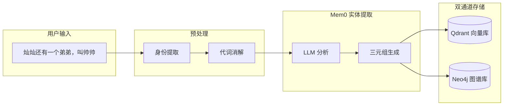
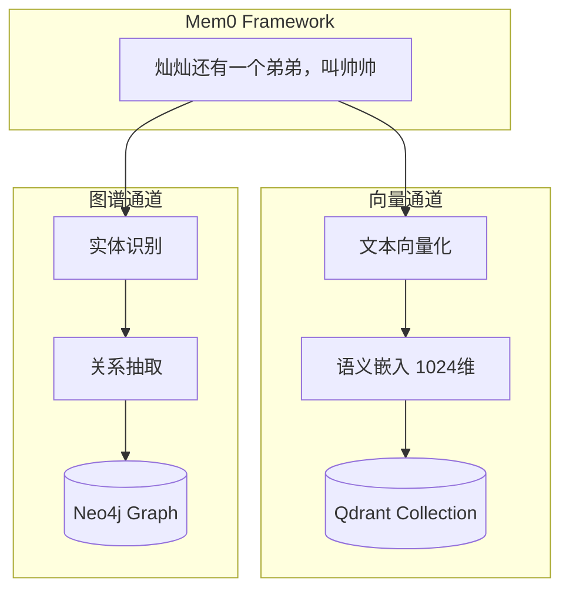
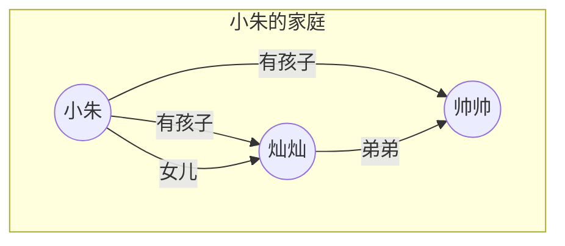
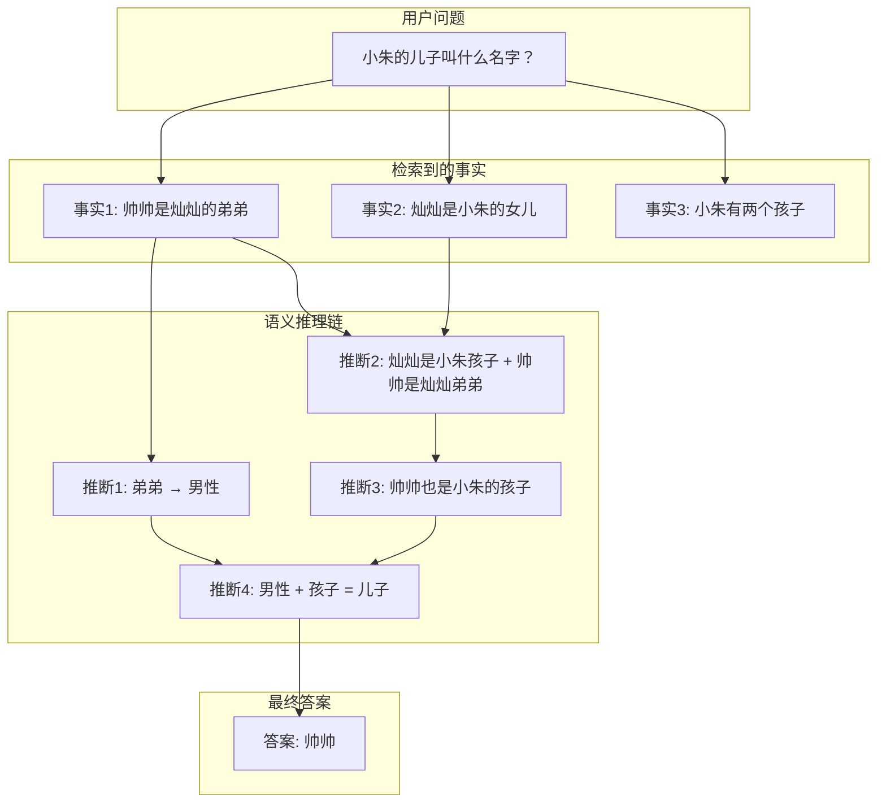
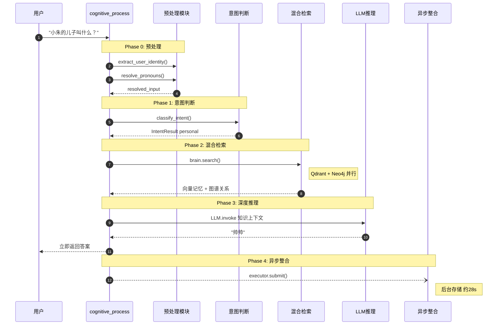

# NeuroMemory 工作原理

> 返回 [主架构文档](ARCHITECTURE.md)
>
> **最后更新**: 2026-01

---

## 一句话理解 NeuroMemory

> **NeuroMemory 是一个神经符号混合记忆系统，能够从碎片化对话中自动构建知识图谱，并进行多跳语义推理。**

本文档通过一个完整的场景演示，帮助你理解：

1. 用户输入后，系统内部发生了什么？
2. 自然语言如何转化为知识图谱？
3. 多跳推理是如何工作的？

---

## 目录

- [场景引入：小朱的家庭](#场景引入小朱的家庭)
- [数据流详解：信息如何变成知识？](#数据流详解信息如何变成知识)
- [知识图谱可视化](#知识图谱可视化)
- [推理过程详解：多跳推理如何工作？](#推理过程详解多跳推理如何工作)
- [认知流程全景图](#认知流程全景图)
- [关键代码入口](#关键代码入口)

---

## 场景引入：小朱的家庭

假设用户通过对话告诉系统以下 4 条信息：

```
用户: "我的名字叫小朱"
用户: "小朱有两个孩子"
用户: "灿灿是小朱的女儿"
用户: "灿灿还有一个弟弟，叫帅帅"
```

然后用户提问：

```
用户: "小朱的儿子叫什么名字？"
```

**注意**：用户从未直接说过"帅帅是小朱的儿子"。系统需要通过多跳推理得出答案。

让我们看看 NeuroMemory 是如何处理这个过程的。

---

## 数据流详解：信息如何变成知识？

以用户输入 `"灿灿还有一个弟弟，叫帅帅"` 为例，展示完整的数据处理流程：

### 整体数据流



### 步骤详解

#### Step 1: 身份提取与代词消解

当用户首次说 `"我的名字叫小朱"` 时，系统会：

1. **提取用户身份**：识别 "小朱" 为当前用户的名字
2. **缓存身份信息**：`USER_IDENTITY_CACHE["demo_user"] = {"name": "小朱"}`

后续输入中的"我"会被自动替换：

| 原始输入 | 代词消解后 |
|----------|------------|
| "我的女儿是灿灿" | "小朱的女儿是灿灿" |
| "我有两个孩子" | "小朱有两个孩子" |

#### Step 2: Mem0 实体提取

Mem0 框架使用 LLM 从自然语言中提取结构化信息：

**输入文本**：
```
"灿灿还有一个弟弟，叫帅帅"
```

**LLM 实体提取结果**：

| 提取类型 | 结果 |
|----------|------|
| 实体 (Entities) | `灿灿`, `帅帅` |
| 关系 (Relationship) | `弟弟` |
| 隐含属性 | `帅帅` 是男性（"弟弟"暗示） |

#### Step 3: 三元组生成

提取的信息被转化为知识图谱的标准格式——**三元组 (Triple)**：

```
(帅帅) --[弟弟]--> (灿灿)
```

在 Neo4j 中存储为：

```cypher
CREATE (帅帅:Entity {name: "帅帅"})
CREATE (灿灿:Entity {name: "灿灿"})
CREATE (帅帅)-[:弟弟]->(灿灿)
```

#### Step 4: 双通道并行存储



| 存储通道 | 存储内容 | 用途 |
|----------|----------|------|
| **Qdrant (向量)** | 原始文本 + 1024 维语义嵌入 | 模糊语义匹配 |
| **Neo4j (图谱)** | 实体节点 + 关系边 | 精确逻辑推理 |

---

## 知识图谱可视化

经过 4 条输入后，Neo4j 中构建的知识图谱如下：



### 图谱中的隐含知识

虽然用户没有直接说"帅帅是小朱的儿子"，但图谱中已经包含足够的信息进行推理：

| 已知事实 | 可推断结论 |
|----------|------------|
| 帅帅是灿灿的弟弟 | 帅帅是男性 |
| 灿灿是小朱的女儿 | 灿灿是小朱的孩子 |
| 帅帅是灿灿的弟弟 + 灿灿是小朱的孩子 | 帅帅也是小朱的孩子 |
| 帅帅是男性 + 帅帅是小朱的孩子 | 帅帅是小朱的儿子 |

---

## 推理过程详解：多跳推理如何工作？

当用户问 `"小朱的儿子叫什么名字？"` 时，系统执行以下步骤：

### 推理链路可视化



### 推理过程拆解

**Step 1: 混合检索**

系统并行查询两个存储：

| 存储 | 查询方式 | 返回结果 |
|------|----------|----------|
| Qdrant | 语义相似度搜索 | "小朱有两个孩子" (score: 0.85) |
| Neo4j | 图谱关系遍历 | `小朱 --[女儿]--> 灿灿`, `灿灿 --[弟弟]--> 帅帅` |

**Step 2: 构建知识上下文**

检索结果被格式化为 LLM 可理解的上下文：

```
[已提取的知识网络]
- 小朱有两个孩子
- 关系: 小朱 --[女儿]--> 灿灿
- 关系: 灿灿 --[弟弟]--> 帅帅
```

**Step 3: LLM 深度推理**

LLM 收到的系统提示包含推理指导：

```
[推理指导]
1. 词汇语义分析：注意词汇的隐含语义
   - "弟弟"暗示男性
   - "女儿"暗示女性且是孩子

2. 关系传递推理：
   - A 是 B 的弟弟 + B 是 C 的孩子 → A 也是 C 的孩子
   - A 是男性 + A 是 C 的孩子 → A 是 C 的儿子

3. 推理步骤显式化：展示完整推理链条
```

**Step 4: 生成答案**

LLM 输出推理过程和最终答案：

```
根据知识网络进行推理：

1. 已知：灿灿是小朱的女儿 → 灿灿是小朱的孩子
2. 已知：帅帅是灿灿的弟弟 → 帅帅和灿灿是兄妹关系
3. 推断：帅帅也是小朱的孩子（弟弟意味着同一父母）
4. 已知：帅帅是"弟弟" → 帅帅是男性
5. 结论：帅帅是男性 + 帅帅是小朱的孩子 → 帅帅是小朱的儿子

答案：小朱的儿子叫帅帅。
```

---

## 认知流程全景图

完整的 `cognitive_process()` 调用流程：



### 各阶段耗时统计

真实运行的性能数据：

```
[性能统计] 用户感知耗时: 10.24s
  - 预处理(身份+消解): 0.00s (0.0%)
  - 意图判断(LLM):     3.77s (36.8%)
  - 混合检索:          1.85s (18.1%)
  - 深度推理(LLM):     4.62s (45.1%)
  - 记忆整合:          异步执行（不阻塞用户）
```

**关键优化**：记忆整合改为异步执行后，用户感知延迟从 ~38s 降低到 ~10s。

---

## 关键代码入口

### 核心函数

| 函数 | 位置 | 职责 |
|------|------|------|
| `cognitive_process()` | `main.py` | 完整认知流程入口 |
| `extract_user_identity()` | `main.py` | 从输入中提取用户身份 |
| `resolve_pronouns()` | `main.py` | 代词消解 |
| `classify_intent()` | `main.py` | LLM 意图判断 |
| `brain.search()` | Mem0 框架 | 混合检索 |
| `brain.add()` | Mem0 框架 | 记忆存储 |

### 快速上手

```python
from main import create_brain, cognitive_process

# 初始化混合记忆系统
brain = create_brain()

# 构建记忆
cognitive_process(brain, "我的名字叫小朱", user_id="demo_user")
cognitive_process(brain, "灿灿是小朱的女儿", user_id="demo_user")
cognitive_process(brain, "灿灿还有一个弟弟，叫帅帅", user_id="demo_user")

# 多跳推理查询
answer = cognitive_process(brain, "小朱的儿子叫什么名字？", user_id="demo_user")
# 输出: 帅帅
```

---

## 相关文档

| 文档 | 说明 |
|------|------|
| [主架构文档](ARCHITECTURE.md) | 系统整体架构设计 |
| [Mem0 深度解析](MEM0_DEEP_DIVE.md) | Mem0 框架原理、API 详解 |
| [核心组件](COMPONENTS.md) | 各组件技术细节 |
| [配置参考](CONFIGURATION.md) | 环境变量、模型切换 |
| [接口设计](API.md) | REST API、CLI |

---

*文档结束*
