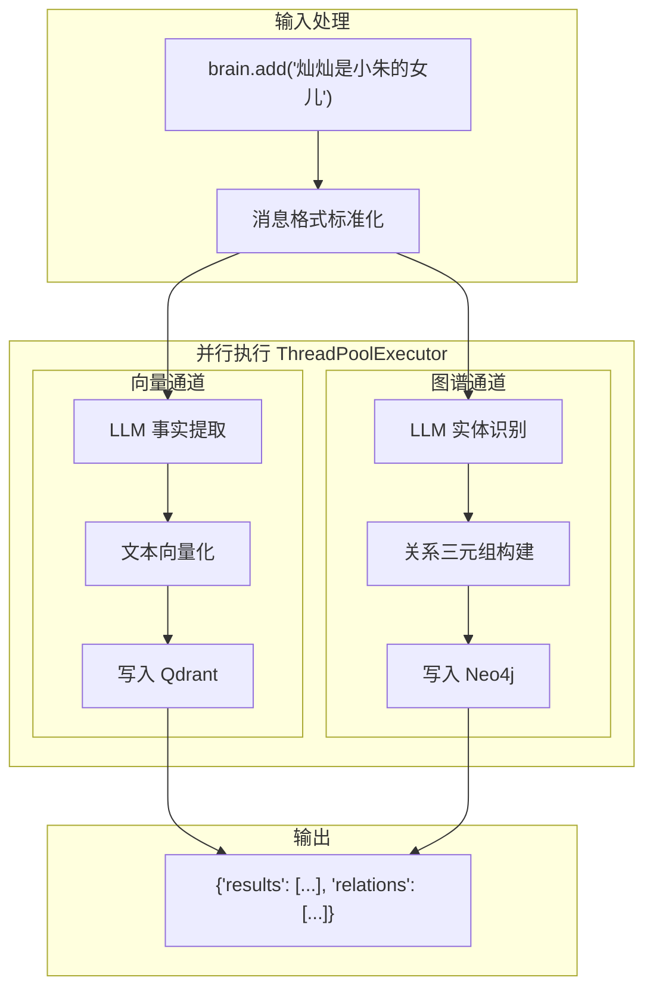
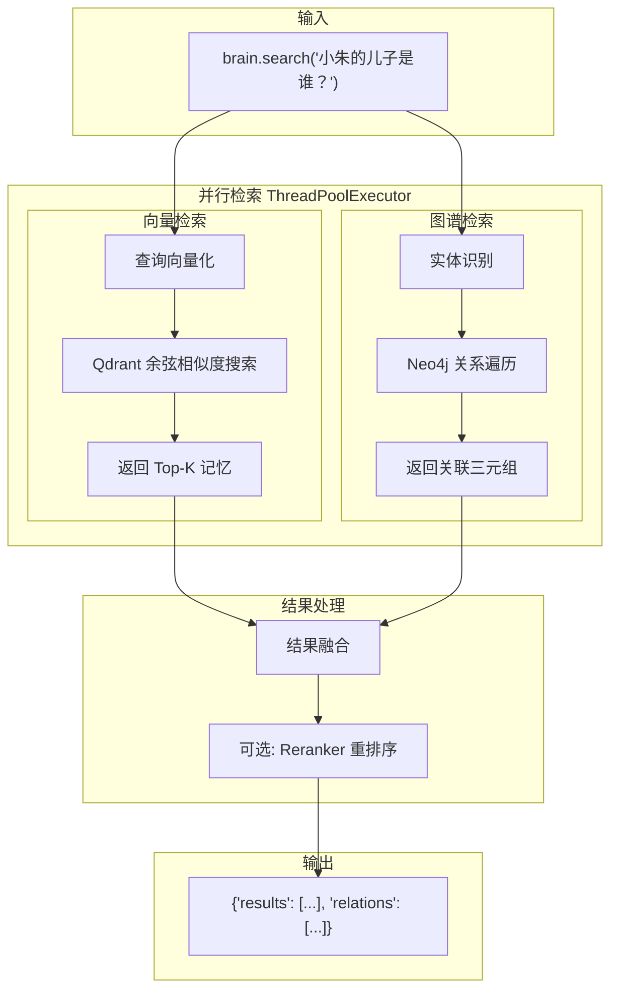
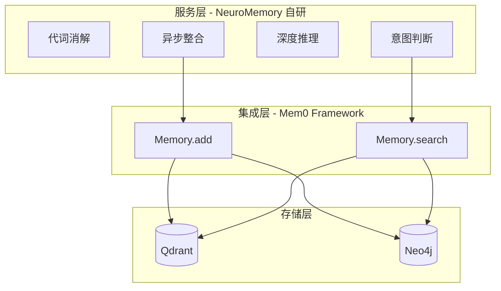
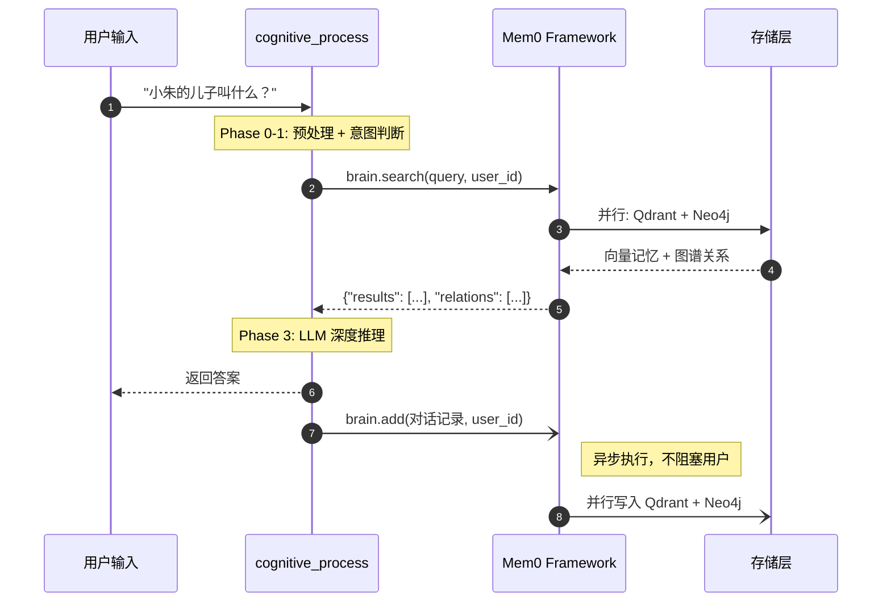
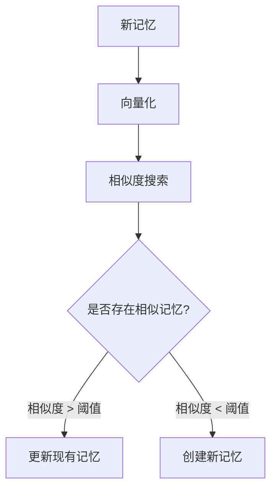

# Mem0 深度解析

> 返回 [主架构文档](ARCHITECTURE.md)
>
> **最后更新**: 2026-01

---

## Mem0 是什么？

> **Mem0 是 NeuroMemory 的"记忆中间件"，抽象了向量存储和图谱存储的复杂性，提供统一的记忆操作接口。**

[Mem0](https://github.com/mem0ai/mem0) 是一个开源的记忆层框架，专为 LLM 应用设计。在 NeuroMemory 系统中，Mem0 承担了**集成层**的角色，屏蔽了底层存储（Qdrant、Neo4j）的实现细节，让上层认知引擎专注于业务逻辑。

---

## 目录

- [为什么选择 Mem0？](#为什么选择-mem0)
- [Mem0 核心 API 解析](#mem0-核心-api-解析)
- [NeuroMemory 中的 Mem0 配置](#neuromemory-中的-mem0-配置)
- [Mem0 在认知流程中的位置](#mem0-在认知流程中的位置)
- [Mem0 内部机制详解](#mem0-内部机制详解)
- [价值总结](#价值总结)

---

## 为什么选择 Mem0？

### 自行实现 vs Mem0 集成

| 能力 | 自行实现 | Mem0 集成 |
|------|----------|-----------|
| **向量+图谱双写** | 需要手动协调两个存储的写入时序和错误处理 | 一次 `add()` 调用，自动并行写入两个存储 |
| **实体提取** | 需要自己设计 Prompt、调用 LLM、解析 JSON | 内置 LLM 实体抽取，自动生成三元组 |
| **语义去重** | 需要自己实现相似度计算和去重逻辑 | 自动检测重复记忆，智能合并或更新 |
| **多存储适配** | 需要为 Qdrant/Pinecone/Milvus 等分别写适配层 | 配置化切换，无需改代码 |
| **用户隔离** | 需要自己维护 user_id 过滤逻辑 | 原生支持 user_id/agent_id/run_id 隔离 |

### 选择 Mem0 的核心理由

1. **减少重复造轮子**：向量+图谱的混合存储模式已被 Mem0 封装，无需重新实现
2. **生产级稳定性**：Mem0 已在多个项目中验证，处理了边界情况和异常
3. **活跃的社区**：持续更新，支持最新的 LLM 和存储后端
4. **OpenAI 兼容接口**：可无缝对接 DeepSeek、SiliconFlow 等国产 API

---

## Mem0 核心 API 解析

NeuroMemory 主要使用 Mem0 的两个核心方法：`add()` 和 `search()`。

### Memory.add() - 记忆写入

#### 调用方式

```python
from mem0 import Memory

brain = Memory.from_config(MEM0_CONFIG)

# 添加记忆
result = brain.add(
    "灿灿是小朱的女儿",
    user_id="demo_user"
)
```

#### 返回结果

```python
{
    "results": [
        {"id": "mem_xxx", "memory": "灿灿是小朱的女儿", "event": "ADD"}
    ],
    "relations": [
        {"source": "灿灿", "relationship": "daughter", "target": "小朱"}
    ]
}
```

#### 内部流程



#### 关键源码解析

Mem0 使用 `ThreadPoolExecutor` 实现双通道并行写入：

```python
# mem0/memory/main.py:369-384
with concurrent.futures.ThreadPoolExecutor() as executor:
    future1 = executor.submit(self._add_to_vector_store, messages, ...)
    future2 = executor.submit(self._add_to_graph, messages, ...)
    
    concurrent.futures.wait([future1, future2])
    
    vector_store_result = future1.result()
    graph_result = future2.result()

if self.enable_graph:
    return {"results": vector_store_result, "relations": graph_result}
return {"results": vector_store_result}
```

---

### Memory.search() - 记忆检索

#### 调用方式

```python
# 混合检索
results = brain.search(
    "小朱的儿子是谁？",
    user_id="demo_user"
)
```

#### 返回结果

```python
{
    "results": [
        {"id": "mem_xxx", "memory": "帅帅是灿灿的弟弟", "score": 0.85},
        {"id": "mem_yyy", "memory": "灿灿是小朱的女儿", "score": 0.82}
    ],
    "relations": [
        {"source": "小朱", "relationship": "女儿", "target": "灿灿"},
        {"source": "灿灿", "relationship": "弟弟", "target": "帅帅"}
    ]
}
```

#### 内部流程



#### 关键源码解析

```python
# mem0/memory/main.py:832-856
with concurrent.futures.ThreadPoolExecutor() as executor:
    future_memories = executor.submit(self._search_vector_store, query, ...)
    future_graph_entities = (
        executor.submit(self.graph.search, query, ...) if self.enable_graph else None
    )
    
    concurrent.futures.wait([future_memories, future_graph_entities] if future_graph_entities else [future_memories])
    
    original_memories = future_memories.result()
    graph_entities = future_graph_entities.result() if future_graph_entities else None

# 可选的重排序
if rerank and self.reranker and original_memories:
    reranked_memories = self.reranker.rerank(query, original_memories, limit)

if self.enable_graph:
    return {"results": original_memories, "relations": graph_entities}
return {"results": original_memories}
```

---

## NeuroMemory 中的 Mem0 配置

### 配置结构

在 [`config.py`](../config.py) 中定义的 `MEM0_CONFIG`：

```python
MEM0_CONFIG = {
    # 向量存储配置
    "vector_store": {
        "provider": "qdrant",
        "config": {
            "host": "localhost",
            "port": 6400,  # 使用 6400 避免 Windows 保留端口冲突（6333 在保留范围 6296-6395 内）
            "collection_name": "neuro_memory_openai_1024",
            "embedding_model_dims": 1024,
        }
    },
    
    # 图谱存储配置（可选，通过 ENABLE_GRAPH_STORE 开关控制）
    "graph_store": {
        "provider": "neo4j",
        "config": {
            "url": "neo4j://localhost:17687",
            "username": "neo4j",
            "password": "password123",
        }
    },
    
    # LLM 配置（用于实体提取）
    "llm": {
        "provider": "openai",  # DeepSeek 使用 OpenAI 兼容接口
        "config": {
            "model": "deepseek-chat",
            "temperature": 0.0,
            "openai_base_url": "https://api.deepseek.com",
        }
    },
    
    # Embedding 配置
    "embedder": {
        "provider": "openai",  # SiliconFlow 使用 OpenAI 兼容接口
        "config": {
            "model": "BAAI/bge-m3",
            "embedding_dims": 1024,
            "openai_base_url": "https://api.siliconflow.cn/v1",
        }
    }
}
```

### 配置说明

| 配置项 | 说明 | NeuroMemory 选型 |
|--------|------|------------------|
| `vector_store` | 向量数据库配置 | Qdrant（本地部署） |
| `graph_store` | 图数据库配置 | Neo4j（本地部署，可禁用） |
| `llm` | 实体提取用 LLM | DeepSeek（OpenAI 兼容接口） |
| `embedder` | 文本向量化模型 | SiliconFlow BGE-M3（1024 维） |

### 初始化方式

```python
from mem0 import Memory
from config import MEM0_CONFIG

def create_brain() -> Memory:
    """初始化混合记忆系统"""
    return Memory.from_config(MEM0_CONFIG)
```

---

## Mem0 在认知流程中的位置

### 架构层级



### 在 cognitive_process() 中的调用



---

## Mem0 内部机制详解

### 1. LLM 驱动的实体提取

当调用 `brain.add("灿灿是小朱的女儿")` 时，Mem0 内部会：

1. 调用配置的 LLM（DeepSeek）分析文本
2. 提取实体：`["灿灿", "小朱"]`
3. 识别关系：`daughter`
4. 构建三元组：`(灿灿, daughter, 小朱)`

### 2. 语义去重机制

Mem0 在写入前会检查是否存在语义相似的记忆：



### 3. 用户隔离

Mem0 原生支持多租户隔离：

```python
# 用户 A 的记忆
brain.add("我喜欢篮球", user_id="user_a")

# 用户 B 的记忆
brain.add("我喜欢足球", user_id="user_b")

# 检索时自动隔离
brain.search("喜欢什么运动？", user_id="user_a")
# 只返回用户 A 的记忆
```

### 4. 支持的存储后端

| 类型 | 支持的后端 |
|------|-----------|
| 向量存储 | Qdrant, Pinecone, Chroma, Milvus, Weaviate, PGVector |
| 图谱存储 | Neo4j, FalkorDB |
| LLM | OpenAI, Anthropic, Gemini, Ollama, Azure OpenAI |
| Embedding | OpenAI, HuggingFace, Gemini, Ollama |

---

## 价值总结

### Mem0 为 NeuroMemory 带来的核心价值

| 价值维度 | 说明 |
|----------|------|
| **开发效率** | 无需自行实现向量+图谱的混合存储抽象层，节省 2-3 周开发时间 |
| **双通道一致性** | `add()` 和 `search()` 保证向量和图谱的原子性操作 |
| **可扩展性** | 配置化切换存储后端，未来可无缝迁移到云服务 |
| **实体提取** | 内置 LLM 驱动的知识抽取，无需手动设计 Prompt |
| **生产就绪** | 处理了并发、异常、去重等生产环境问题 |

### NeuroMemory 在 Mem0 之上的增值

虽然 Mem0 提供了强大的基础能力，NeuroMemory 在其之上构建了更高级的认知功能：

| 增值功能 | 说明 |
|----------|------|
| **代词消解** | "我" → 用户名替换，Mem0 不提供 |
| **意图判断** | personal/factual/general 分类，Mem0 不提供 |
| **多跳推理** | 基于图谱的深度推理 Prompt，NeuroMemory 自研 |
| **关系归一化** | 英文→中文关系类型映射，NeuroMemory 自研 |
| **异步整合** | 非阻塞的后台记忆存储，NeuroMemory 优化 |

---

## 相关文档

| 文档 | 说明 |
|------|------|
| [工作原理](HOW_IT_WORKS.md) | 场景演示，从用户视角理解系统 |
| [核心组件](COMPONENTS.md) | 各组件技术细节 |
| [配置参考](CONFIGURATION.md) | 环境变量、模型切换 |
| [Mem0 官方文档](https://docs.mem0.ai/) | Mem0 框架完整文档 |

---

*文档结束*
