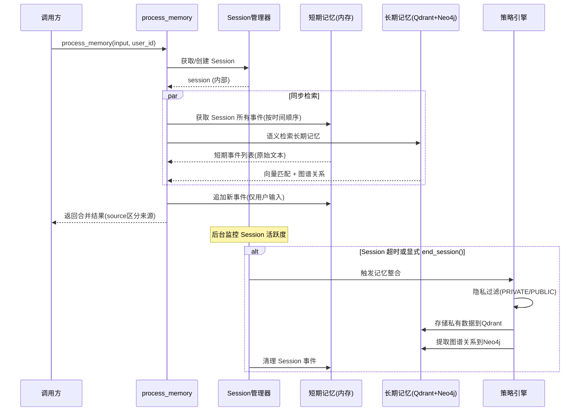

# NeuroMemory Session 记忆管理设计文档

> **最后更新**: 2026-01-22  
> **状态**: 设计文档，待实现  
> **参考**: [AWS Bedrock AgentCore Memory](https://docs.aws.amazon.com/bedrock-agentcore/latest/devguide/memory.html)

---

## 1. 设计目标

### 1.1 核心理念

NeuroMemory 定位为**"外挂大脑" (Memory-as-a-Service)**，用户不应关心底层的记忆管理细节。与 AWS AgentCore 的显式 Session 管理不同，我们采用**内部自动 Session 管理**策略：

| 设计原则 | 说明 |
|----------|------|
| **用户无感知** | 用户无需传递 session_id，系统内部自动管理 |
| **统一入口** | 保持 `process_memory(input, user_id)` 一体化接口 |
| **智能分流** | 内部 LLM 自动判断存储/检索意图 |
| **自动整合** | Session 超时或显式结束时自动转为长期记忆 |

### 1.2 与 AWS AgentCore 的对比

| 维度 | AWS AgentCore | NeuroMemory (本设计) |
|------|---------------|---------------------|
| Session 管理 | 用户显式传 session_id | 系统内部自动管理 |
| 存储/检索 | 分离接口 (create_event / retrieve) | 统一入口，LLM 智能判断 |
| Session 结束 | 用户决定何时结束 | 超时自动结束 + 可选显式结束 |
| 复杂度 | 更灵活但更复杂 | 更简单，开箱即用 |

---

## 2. 记忆层级架构

### 2.1 双层记忆模型

```
┌─────────────────────────────────────────────────────────────┐
│                     用户交互层                               │
│              process_memory(input, user_id)                 │
└─────────────────────────────────────────────────────────────┘
                              │
                              ▼
┌─────────────────────────────────────────────────────────────┐
│                   Session 管理器                             │
│    ┌─────────────────────────────────────────────────┐     │
│    │  内部 Session 表 (user_id -> Session)            │     │
│    │  - session_id (内部生成)                         │     │
│    │  - events: List[Event]                          │     │
│    │  - created_at, last_active_at                   │     │
│    │  - status: ACTIVE / ENDED                       │     │
│    └─────────────────────────────────────────────────┘     │
└─────────────────────────────────────────────────────────────┘
                              │
              ┌───────────────┴───────────────┐
              ▼                               ▼
┌─────────────────────────┐     ┌─────────────────────────────┐
│      短期记忆            │     │         长期记忆             │
│   (Session 内上下文)     │     │    (跨 Session 知识)         │
├─────────────────────────┤     ├─────────────────────────────┤
│ 存储: 内存 Dict          │     │ 存储: Qdrant + Neo4j        │
│ 内容: 用户输入原始文本   │     │ 内容: 向量化文本 + 实体关系  │
│ 检索: 按时间顺序返回     │     │ 检索: 语义检索 + 图谱查询    │
│ 向量化: 否               │     │ 向量化: 是                   │
│ 生命周期: Session 内     │     │ 生命周期: 永久 (可配置过期)  │
│ 用途: 提供上下文给调用方 │     │ 用途: 跨会话知识检索         │
│       Session结束时提取  │     │                              │
└─────────────────────────┘     └─────────────────────────────┘
```

### 2.2 短期与长期存储的分工

| 维度 | 短期存储 (内存) | 长期存储 (Qdrant + Neo4j) |
|------|----------------|---------------------------|
| **存储内容** | 用户输入原始文本 | 向量化文本 + 实体关系图谱 |
| **是否向量化** | 否 | 是 |
| **是否返回给调用方** | **否（仅内部使用）** | 是 |
| **生命周期** | Session 内有效 | 永久（可配置过期） |
| **主要用途** | 指代消解的上下文 | 跨 Session 的知识检索 |
| **数据流向** | Session 结束时 → 整合 → 长期存储 | - |

**关键设计决策**：
- NeuroMemory **只接收用户输入**，不接收 assistant 回复
- **短期记忆不返回给调用方**：调用方的主 LLM 已有这些上下文，返回是冗余的
- 短期记忆的核心价值是**指代消解**，而非直接返回

### 2.3 数据流向



### 2.4 process_memory 处理流程

```
process_memory(input, user_id)
         │
         ▼
┌─────────────────────────────────┐
│  1. Session 管理                │
│  - 查找用户活跃 Session         │
│  - 若无则创建新 Session         │
│  - 刷新 last_active_at          │
└─────────────────────────────────┘
         │
         ▼
┌─────────────────────────────────┐
│  2. 指代消解（规则匹配）        │
│  - 获取最近 3-5 条短期事件      │
│  - 用规则消解当前输入中的代词   │
│  - 例: "这个" → "桔子"          │
└─────────────────────────────────┘
         │
         ▼
┌─────────────────────────────────┐
│  3. 长期记忆检索                │
│  - 用消解后的查询检索 Qdrant    │
│  - 用消解后的查询检索 Neo4j     │
└─────────────────────────────────┘
         │
         ▼
┌─────────────────────────────────┐
│  4. 追加事件到短期存储          │
│  Event(role="user",             │
│        content=原始input,       │  ← 存原始输入，不存消解后的
│        timestamp=now)           │
└─────────────────────────────────┘
         │
         ▼
┌─────────────────────────────────┐
│  5. 返回长期记忆结果            │
│  - memories: 向量检索结果       │
│  - relations: 图谱关系          │
│  - resolved_query: 消解后查询   │
│  （不返回短期记忆）             │
└─────────────────────────────────┘
```

### 2.5 指代消解机制

**核心问题**：用户输入中的代词（"这个"、"她"、"它"）需要消解才能正确检索。

**两个消解时机**：

| 时机 | 方法 | 目的 | 示例 |
|------|------|------|------|
| **检索时** | 规则匹配（快） | 让查询更精准 | "你喜欢吃这个吗？" → "你喜欢吃桔子吗？" |
| **整合时** | LLM 消解（准） | 让存储内容可独立理解 | "她今年5岁" → "灿灿今年5岁" |

**检索时消解流程**：
```
短期记忆: ["桔子熟了", "很甜"]
当前输入: "你喜欢吃这个吗？"
                ↓
规则匹配: 检测到 "这个"，查找最近事件中的名词
                ↓
消解结果: "你喜欢吃桔子吗？"
                ↓
用消解后的查询检索长期记忆
```

**整合时消解流程**（Session 结束时）：
```
短期记忆: ["我女儿叫灿灿", "她今年5岁", "她喜欢画画"]
                ↓
LLM 语义分组 + 消解
                ↓
整合结果: ["灿灿是我的女儿，今年5岁，喜欢画画"]
                ↓
隐私过滤 → 存入长期记忆
```

**消解失败处理**：
- 检索时：使用原始查询
- 整合时：**跳过存储**（无法独立理解的内容不存入长期记忆）

---

## 3. 核心数据结构

### 3.1 Event (事件)

每次用户交互记录为一个 Event，结构简洁（类似 OpenAI message）：

```python
@dataclass
class Event:
    """会话事件"""
    event_id: str           # 自动生成的唯一ID
    role: str               # "user" | "assistant" | "system"
    content: str            # 事件内容
    timestamp: datetime     # 事件时间
    metadata: dict = None   # 可选元数据
```

**示例**:
```python
Event(
    event_id="evt_abc123",
    role="user",
    content="我女儿叫灿灿，今年5岁了",
    timestamp=datetime(2026, 1, 22, 10, 30, 0),
    metadata={"source": "dify"}
)
```

### 3.2 Session (会话)

```python
@dataclass
class Session:
    """用户会话"""
    session_id: str              # 内部生成，对用户不可见
    user_id: str                 # 用户标识
    events: list[Event]          # 事件列表
    created_at: datetime         # 创建时间
    last_active_at: datetime     # 最后活跃时间
    status: SessionStatus        # ACTIVE | ENDING | ENDED

class SessionStatus(Enum):
    ACTIVE = "active"            # 活跃中
    ENDING = "ending"            # 正在整合到长期记忆
    ENDED = "ended"              # 已结束
```

### 3.3 MemoryRecord (长期记忆记录)

```python
@dataclass
class MemoryRecord:
    """长期记忆记录"""
    record_id: str              # 唯一ID
    user_id: str                # 所属用户
    content: str                # 记忆内容
    source_session_id: str      # 来源 Session
    strategy_type: str          # 提取策略 ("privacy_filter" | "graph_extraction")
    created_at: datetime        # 创建时间
    metadata: dict = None       # 元数据
```

---

## 4. Session 生命周期管理

### 4.1 Session 状态机

```mermaid
stateDiagram-v2
    [*] --> ACTIVE: 首次 process_memory
    ACTIVE --> ACTIVE: 持续交互 (刷新 last_active_at)
    ACTIVE --> ENDING: 超时 / end_session()
    ENDING --> ENDED: 整合完成
    ENDED --> [*]: 清理
    
    note right of ACTIVE: 默认超时: 30分钟
    note right of ENDING: 执行策略提取
```

### 4.2 自动 Session 管理规则

| 规则 | 说明 | 默认值 |
|------|------|--------|
| **自动创建** | 用户首次调用 `process_memory` 时自动创建 Session | - |
| **单 Session** | 每个用户同一时间只有一个活跃 Session | - |
| **活跃保持** | 每次调用刷新 `last_active_at` | - |
| **超时结束** | 超过 `SESSION_TIMEOUT` 无活动自动结束 | 30 分钟 |
| **最大时长** | Session 最大存活时间（即使持续活跃） | 24 小时 |
| **最大事件数** | 单个 Session 最大事件数，超过自动结束 | 100 条 |
| **空 Session** | 无事件的 Session 超时时直接清理，跳过整合 | - |

### 4.3 Session 结束时的整合流程

当 Session 结束（超时或显式调用）时，执行以下流程：

```
Session 结束
     │
     ▼
┌─────────────────────────────────────┐
│  1. 收集所有事件                    │
│  events = session.events            │
│  若 events 为空，跳过整合，直接清理 │
└─────────────────────────────────────┘
     │
     ▼
┌─────────────────────────────────────┐
│  2. LLM 语义分组 + 指代消解         │
│  - 将相关事件分组                   │
│  - 消解每组中的代词                 │
│  - 每组合并为一条完整记忆           │
│                                     │
│  示例:                              │
│  输入: ["我女儿叫灿灿",              │
│         "她今年5岁",                │
│         "她喜欢画画"]               │
│  输出: ["灿灿是我的女儿，今年5岁，   │
│          喜欢画画"]                 │
└─────────────────────────────────────┘
     │
     ▼
┌─────────────────────────────────────┐
│  3. 隐私过滤 (每条整合后的记忆)     │
│  - PRIVATE → 继续处理               │
│  - PUBLIC → 丢弃                    │
│  - 消解失败 → 跳过存储              │
└─────────────────────────────────────┘
     │
     ▼
┌─────────────────────────────────────┐
│  4. 存储到长期记忆                  │
│  - 向量化存入 Qdrant                │
│  - 提取图谱关系存入 Neo4j           │
└─────────────────────────────────────┘
     │
     ▼
┌─────────────────────────────────────┐
│  5. 清理短期存储                    │
│  delete_session(session_id)         │
└─────────────────────────────────────┘
```

**整合策略：语义分组合并**

```python
async def consolidate_session(events: list[Event], user_id: str) -> list[str]:
    """
    将 Session 事件整合为可独立理解的记忆
    
    1. LLM 对事件进行语义分组（相关内容放一组）
    2. LLM 消解每组中的代词
    3. 每组合并为一条完整的记忆
    4. 返回整合后的记忆列表
    """
    prompt = f"""
    以下是用户的一段对话历史，请帮我整合为可独立理解的记忆：
    
    对话历史：
    {[e.content for e in events]}
    
    要求：
    1. 将相关内容分组
    2. 消解代词（如"她"→"灿灿"）
    3. 每组合并为一句完整的陈述
    4. 确保每条记忆可以脱离上下文独立理解
    5. 如果某条内容无法消解代词，则跳过
    
    返回 JSON 数组：["记忆1", "记忆2", ...]
    """
    # ... LLM 调用
```

---

## 5. API 接口设计

### 5.1 主接口（保持不变）

```python
def process_memory(
    input: str,
    user_id: str,
) -> dict:
    """
    处理用户输入，检索相关记忆并异步存储。
    
    内部自动管理 Session：
    - 如果用户有活跃 Session，追加事件
    - 如果没有活跃 Session，自动创建新 Session
    
    Args:
        input: 用户输入文本
        user_id: 用户标识
        
    Returns:
        {
            "status": "success",
            "context": {
                "short_term": [...],   # 当前 Session 的相关事件
                "long_term": {
                    "vector_chunks": [...],
                    "graph_relations": [...]
                }
            },
            "metadata": {
                "retrieval_time_ms": 123,
                "has_memory": true,
                "session_event_count": 5
            }
        }
    """
```

### 5.2 新增接口

#### 5.2.1 结束会话

```python
def end_session(user_id: str) -> dict:
    """
    显式结束用户的当前会话（异步执行，立即返回）。
    
    后台触发长期记忆整合流程：
    1. 对 Session 事件执行隐私过滤 (PRIVATE/PUBLIC)
    2. 存储私有数据到 Qdrant（向量化）
    3. 提取图谱关系到 Neo4j
    4. 清理短期存储
    
    Args:
        user_id: 用户标识
        
    Returns:
        {
            "status": "success",
            "message": "Session ending, consolidation started",
            "session_info": {
                "event_count": 10,
                "duration_seconds": 1500,
                "created_at": "2026-01-22T10:00:00Z",
                "ended_at": "2026-01-22T10:25:00Z"
            }
        }
    
    如果用户没有活跃 Session：
        {
            "status": "success",
            "message": "No active session",
            "session_info": null
        }
    
    注意：
    - 接口立即返回，整合过程在后台异步执行
    - 整合可能需要几秒到几十秒（取决于事件数量）
    - 整合完成前，新的 process_memory 调用会创建新 Session
    """
```

#### 5.2.2 获取会话状态（可选，用于调试）

```python
def get_session_status(user_id: str) -> dict:
    """
    获取用户当前会话状态（调试用）。
    
    Args:
        user_id: 用户标识
        
    Returns:
        {
            "status": "success",
            "has_active_session": true,
            "session_info": {
                "event_count": 5,
                "created_at": "2026-01-22T10:00:00Z",
                "last_active_at": "2026-01-22T10:25:00Z",
                "time_until_timeout_seconds": 300
            }
        }
    """
```

### 5.3 HTTP API 端点

| 方法 | 端点 | 说明 |
|------|------|------|
| POST | `/process` | 处理记忆（主入口，不变） |
| POST | `/end-session` | 结束当前会话 |
| GET | `/session-status/{user_id}` | 获取会话状态（调试） |
| POST | `/debug` | 调试模式（不变） |
| GET | `/graph/{user_id}` | 获取知识图谱（不变） |
| GET | `/health` | 健康检查（不变） |

### 5.4 MCP Tools

| Tool | 说明 |
|------|------|
| `process_memory` | 处理记忆（不变） |
| `end_session` | 结束当前会话（新增） |
| `get_session_status` | 获取会话状态（新增，调试用） |
| `debug_process_memory` | 调试模式（不变） |
| `get_user_graph` | 获取知识图谱（不变） |

---

## 6. 返回格式设计

### 6.1 最优返回结构

采用语义清晰的命名，只返回长期记忆（短期记忆仅内部使用）：

```json
{
    "status": "success",
    "resolved_query": "你喜欢吃桔子吗？",
    "memories": [
        {
            "content": "我喜欢吃桔子",
            "score": 0.87
        },
        {
            "content": "桔子是我最喜欢的水果",
            "score": 0.72
        }
    ],
    "relations": [
        {
            "source": "小朱",
            "relation": "喜欢",
            "target": "桔子"
        }
    ],
    "metadata": {
        "retrieval_time_ms": 45,
        "has_memory": true
    }
}
```

### 6.2 字段说明

| 字段 | 类型 | 说明 |
|------|------|------|
| `resolved_query` | string | 指代消解后的查询，便于调试和理解检索逻辑 |
| `memories` | array | 从长期记忆中检索到的相关内容 |
| `memories[].content` | string | 记忆内容 |
| `memories[].score` | number | 相关度分数 (0-1) |
| `relations` | array | 知识图谱中的相关关系 |
| `relations[].source` | string | 关系起点实体 |
| `relations[].relation` | string | 关系类型 |
| `relations[].target` | string | 关系终点实体 |
| `metadata.retrieval_time_ms` | number | 检索耗时（毫秒） |
| `metadata.has_memory` | boolean | 是否检索到相关记忆 |

### 6.3 设计原则

| 原则 | 说明 |
|------|------|
| **只返回长期记忆** | 短期记忆对调用方冗余，不返回 |
| **暴露消解结果** | `resolved_query` 让调用方知道系统理解的是什么 |
| **语义化命名** | `memories` 比 `vector_chunks` 更直观，隐藏实现细节 |
| **简洁** | 移除冗余字段（如 source，因为都是长期记忆） |

### 6.4 无记忆时的返回

```json
{
    "status": "success",
    "resolved_query": "你喜欢吃桔子吗？",
    "memories": [],
    "relations": [],
    "metadata": {
        "retrieval_time_ms": 15,
        "has_memory": false
    }
}
```

### 6.5 格式说明

| 旧格式 | 当前格式 | 变更原因 |
|---------|---------|----------|
| `vector_chunks` | `memories` | 更直观，隐藏实现细节 |
| `vector_chunks[].memory` | `memories[].content` | 更通用的命名 |
| `graph_relations` | `relations` | 更简洁 |
| `graph_relations[].relationship` | `relations[].relation` | 更简洁 |
| 无 | `resolved_query` | 新增，调试价值高 |
| `source: "short_term/long_term"` | 移除 | 只返回长期记忆，无需区分 |

---

## 7. 配置参数

### 7.1 新增配置项

```python
# config.py

# =============================================================================
# Session 管理配置
# =============================================================================

# Session 超时时间（秒），超过此时间无活动自动结束
# 可通过环境变量 SESSION_TIMEOUT 覆盖
SESSION_TIMEOUT_SECONDS = int(os.getenv("SESSION_TIMEOUT", 30 * 60))  # 默认 30 分钟

# Session 最大存活时间（秒），即使持续活跃也会强制结束
SESSION_MAX_DURATION_SECONDS = int(os.getenv("SESSION_MAX_DURATION", 24 * 60 * 60))  # 默认 24 小时

# 单个 Session 最大事件数，超过后自动结束并整合
SESSION_MAX_EVENTS = int(os.getenv("SESSION_MAX_EVENTS", 100))

# Session 超时检查间隔（秒）
SESSION_CHECK_INTERVAL_SECONDS = 60  # 每分钟检查一次

# =============================================================================
# 指代消解配置
# =============================================================================

# 检索时用于消解的最近事件数
COREFERENCE_CONTEXT_SIZE = int(os.getenv("COREFERENCE_CONTEXT_SIZE", 5))  # 默认最近 5 条

# =============================================================================
# 长期记忆策略配置
# =============================================================================

# 启用的策略列表
MEMORY_STRATEGIES = [
    "privacy_filter",    # 隐私过滤（PRIVATE/PUBLIC）
    "graph_extraction",  # 图谱关系提取
]

# 策略触发时机（目前仅支持 on_session_end）
STRATEGY_TRIGGER = "on_session_end"
```

### 7.2 配置说明

| 配置项 | 默认值 | 环境变量 | 说明 |
|--------|--------|----------|------|
| `SESSION_TIMEOUT_SECONDS` | 1800 (30分钟) | `SESSION_TIMEOUT` | 无活动超时时间 |
| `SESSION_MAX_DURATION_SECONDS` | 86400 (24小时) | `SESSION_MAX_DURATION` | 最大存活时间 |
| `SESSION_MAX_EVENTS` | 100 | `SESSION_MAX_EVENTS` | 单Session最大事件数 |
| `COREFERENCE_CONTEXT_SIZE` | 5 | `COREFERENCE_CONTEXT_SIZE` | 检索时消解用的上下文事件数 |

### 7.3 超时时间建议

| 场景 | 推荐超时 | 说明 |
|------|----------|------|
| 快速问答 | 15 分钟 | 用户快速查询，不需要长上下文 |
| 日常对话 | 30 分钟 | 平衡上下文保持和资源占用（默认） |
| 深度讨论 | 60 分钟 | 复杂话题，需要保持更长上下文 |
| 工作会话 | 2-4 小时 | 持续工作场景 |

---

## 8. 实现模块设计

### 8.1 新增模块

```
neuro_memory/
├── session_manager.py    # Session 生命周期管理
├── short_term_store.py   # 短期记忆存储（内存实现）
├── coreference.py        # 指代消解模块（新增）
│   ├── resolve_query()   # 检索时消解（规则）
│   └── resolve_events()  # 整合时消解（LLM）
├── consolidator.py       # Session 整合器（新增）
│   └── consolidate()     # 语义分组 + 消解 + 合并
├── strategies/           # 记忆策略
│   ├── __init__.py
│   ├── base.py           # 策略基类
│   ├── privacy_filter.py # 隐私过滤策略（重构自现有）
│   └── graph_extraction.py # 图谱提取策略
├── private_brain.py      # 核心逻辑（重构）
├── mcp_server.py         # MCP Server（更新）
├── http_server.py        # HTTP Server（更新）
└── config.py             # 配置（更新）
```

### 8.2 SessionManager 类设计

```python
class SessionManager:
    """Session 生命周期管理器"""
    
    def __init__(self):
        self._sessions: dict[str, Session] = {}  # user_id -> Session
        self._lock = asyncio.Lock()
        self._timeout_task: asyncio.Task | None = None
    
    async def get_or_create_session(self, user_id: str) -> Session:
        """获取或创建用户 Session"""
        pass
    
    async def add_event(self, user_id: str, event: Event) -> None:
        """向用户 Session 添加事件"""
        pass
    
    async def end_session(self, user_id: str) -> SessionSummary:
        """结束用户 Session"""
        pass
    
    async def get_session_events(
        self, user_id: str, limit: int = 20
    ) -> list[Event]:
        """获取用户 Session 的最近事件"""
        pass
    
    async def _check_timeouts(self) -> None:
        """定期检查并结束超时 Session"""
        pass
    
    async def _consolidate_session(self, session: Session) -> None:
        """将 Session 整合到长期记忆"""
        pass
```

### 8.3 Coreference 模块设计

```python
class CoreferenceResolver:
    """指代消解器"""
    
    def resolve_query(
        self, 
        query: str, 
        context_events: list[Event]
    ) -> str:
        """
        检索时消解（规则匹配，快速）
        
        Args:
            query: 当前用户查询
            context_events: 最近的短期事件（用于提取上下文）
            
        Returns:
            消解后的查询
        """
        # 规则示例：
        # - "这个" → 查找最近事件中的名词
        # - "她/他" → 查找最近事件中的人名
        # - "它" → 查找最近事件中的事物名词
        pass
    
    async def resolve_events(
        self, 
        events: list[Event]
    ) -> list[str]:
        """
        整合时消解（LLM，准确）
        
        Args:
            events: Session 中的所有事件
            
        Returns:
            消解后的记忆列表（已分组合并）
        """
        # LLM prompt:
        # 1. 语义分组相关事件
        # 2. 消解每组中的代词
        # 3. 合并为完整陈述
        pass
```

### 8.4 Consolidator 模块设计

```python
class SessionConsolidator:
    """Session 整合器"""
    
    def __init__(
        self,
        coreference: CoreferenceResolver,
        privacy_filter: PrivacyFilter,
        long_term_store: LongTermStore,
    ):
        self.coreference = coreference
        self.privacy_filter = privacy_filter
        self.long_term_store = long_term_store
    
    async def consolidate(
        self, 
        session: Session
    ) -> ConsolidationResult:
        """
        整合 Session 到长期记忆
        
        流程:
        1. 跳过空 Session
        2. LLM 语义分组 + 指代消解
        3. 隐私过滤（跳过 PUBLIC 和消解失败的）
        4. 存入长期记忆（Qdrant + Neo4j）
        
        Returns:
            ConsolidationResult: 整合统计
        """
        if not session.events:
            return ConsolidationResult(skipped=True, reason="empty_session")
        
        # 1. LLM 消解 + 合并
        resolved_memories = await self.coreference.resolve_events(session.events)
        
        # 2. 隐私过滤 + 存储
        stored_count = 0
        for memory in resolved_memories:
            privacy_type, reason = self.privacy_filter.classify(memory)
            if privacy_type == "PRIVATE":
                await self.long_term_store.save(memory, session.user_id)
                stored_count += 1
        
        return ConsolidationResult(
            stored_count=stored_count,
            total_events=len(session.events),
        )
```

### 8.5 Strategy 基类设计

```python
from abc import ABC, abstractmethod

class MemoryStrategy(ABC):
    """记忆策略基类"""
    
    @property
    @abstractmethod
    def name(self) -> str:
        """策略名称"""
        pass
    
    @abstractmethod
    async def extract(
        self, events: list[Event], user_id: str
    ) -> list[MemoryRecord]:
        """
        从事件列表中提取记忆记录
        
        Args:
            events: Session 中的事件列表
            user_id: 用户标识
            
        Returns:
            提取出的记忆记录列表
        """
        pass
```

---

## 9. 迁移计划

**实现策略**：Session 管理优先，策略先复用现有逻辑

### 9.1 阶段一：Session 基础设施

**目标**：实现 Session 管理，不破坏现有功能

| 任务 | 文件 | 说明 |
|------|------|------|
| 1 | `session_manager.py` | Session 生命周期管理（创建/获取/结束/超时） |
| 2 | `short_term_store.py` | 内存 Dict 实现的短期存储 |
| 3 | `config.py` | 新增 Session 相关配置项 |

### 9.2 阶段二：指代消解与整合

**目标**：实现指代消解和 Session 整合逻辑

| 任务 | 文件 | 说明 |
|------|------|------|
| 1 | `coreference.py` | 指代消解模块（规则 + LLM） |
| 2 | `consolidator.py` | Session 整合器（分组 + 消解 + 存储） |
| 3 | 测试 | 消解规则和 LLM prompt 调优 |

### 9.3 阶段三：核心集成

**目标**：将 Session 和消解集成到 PrivateBrain

| 任务 | 文件 | 说明 |
|------|------|------|
| 1 | `private_brain.py` | 修改 `process()` 集成消解逻辑 |
| 2 | `private_brain.py` | 新增 `end_session()` 方法 |
| 3 | `private_brain.py` | 更新返回格式（memories/relations/resolved_query） |

### 9.4 阶段四：API 更新

**目标**：暴露新接口

| 任务 | 文件 | 说明 |
|------|------|------|
| 1 | `http_server.py` | 新增 `POST /end-session` |
| 2 | `http_server.py` | 新增 `GET /session-status/{user_id}` |
| 3 | `http_server.py` | 更新 `/process` 返回格式 |
| 4 | `mcp_server.py` | 新增 `end_session` tool |
| 5 | `mcp_server.py` | 新增 `get_session_status` tool |
| 6 | `mcp_server.py` | 更新 `process_memory` 返回格式 |

### 9.5 阶段五：测试和文档

| 任务 | 说明 |
|------|------|
| 1 | 编写 SessionManager 单元测试 |
| 2 | 编写指代消解单元测试（规则 + LLM） |
| 3 | 编写 Session 整合集成测试 |
| 4 | 更新 `USER_API.md` 文档 |
| 5 | 更新 `ARCHITECTURE.md` |

### 9.6 后续阶段（可选）

| 任务 | 说明 |
|------|------|
| 重构策略模式 | 将隐私过滤和图谱提取抽象为策略接口 |
| 消解规则优化 | 更多的规则模式（时间词、地点词等） |
| 新增摘要策略 | Session 结束时生成对话摘要 |
| Redis 存储 | 将短期存储升级为 Redis（生产环境） |

---

## 10. 使用示例

### 10.1 典型对话流程

```python
# 第一次调用 - 自动创建 Session，无长期记忆
result1 = process_memory("我叫小朱", user_id="user_001")
# 返回:
# {
#     "status": "success",
#     "resolved_query": "我叫小朱",   # 无需消解
#     "memories": [],                  # 无长期记忆
#     "relations": [],
#     "metadata": {"retrieval_time_ms": 20, "has_memory": false}
# }
# 内部：事件存入短期存储

# 第二次调用
result2 = process_memory("我女儿叫灿灿", user_id="user_001")
# 返回同上（无长期记忆）
# 内部：事件存入短期存储

# 第三次调用 - 包含代词
result3 = process_memory("她今年几岁了？", user_id="user_001")
# 内部处理：
#   1. 获取最近短期事件: ["我叫小朱", "我女儿叫灿灿"]
#   2. 规则消解: "她" → "灿灿"
#   3. resolved_query = "灿灿今年几岁了？"
#   4. 用 "灿灿今年几岁了？" 检索长期记忆（无结果）
# 返回:
# {
#     "status": "success",
#     "resolved_query": "灿灿今年几岁了？",  # 消解后的查询
#     "memories": [],
#     "relations": [],
#     "metadata": {"retrieval_time_ms": 25, "has_memory": false}
# }

# 显式结束 Session
summary = end_session(user_id="user_001")
# 返回（立即）:
# {
#     "status": "success",
#     "message": "Session ending, consolidation started",
#     "session_info": {"event_count": 3, "duration_seconds": 120}
# }
# 后台异步执行：
#   1. LLM 语义分组: ["我叫小朱", "我女儿叫灿灿", "她今年几岁了？"]
#      → 整合为: ["小朱有一个女儿叫灿灿"]  （问句被过滤）
#   2. 隐私过滤: PRIVATE
#   3. 存入 Qdrant + Neo4j
```

### 10.2 指代消解示例

```python
# Session 内的对话
process_memory("桔子熟了", user_id="user_001")
process_memory("很甜", user_id="user_001")

# 第三次调用包含代词
result = process_memory("你喜欢吃这个吗？", user_id="user_001")
# 内部处理：
#   短期事件: ["桔子熟了", "很甜"]
#   规则消解: "这个" → 检测到最近名词 "桔子"
#   resolved_query = "你喜欢吃桔子吗？"
# 返回:
# {
#     "resolved_query": "你喜欢吃桔子吗？",
#     "memories": [
#         {"content": "我喜欢吃桔子", "score": 0.89}  # 从长期记忆检索
#     ],
#     "relations": [],
#     ...
# }
```

### 10.3 Session 整合示例

```python
# 用户的一段对话
process_memory("我女儿叫灿灿", user_id="user_001")
process_memory("她今年5岁", user_id="user_001")
process_memory("她喜欢画画", user_id="user_001")
process_memory("北京是中国的首都", user_id="user_001")  # 公共知识

# Session 结束时的整合过程：
# 1. LLM 语义分组 + 消解:
#    - 组1: ["我女儿叫灿灿", "她今年5岁", "她喜欢画画"]
#      → "灿灿是我的女儿，今年5岁，喜欢画画"
#    - 组2: ["北京是中国的首都"]
#      → "北京是中国的首都"
#
# 2. 隐私过滤:
#    - "灿灿是我的女儿，今年5岁，喜欢画画" → PRIVATE → 存储
#    - "北京是中国的首都" → PUBLIC → 丢弃
#
# 3. 最终存入长期记忆: "灿灿是我的女儿，今年5岁，喜欢画画"
```

### 10.4 跨 Session 查询

```python
# 新的 Session（之前的已整合）
result = process_memory("小朱的女儿喜欢什么？", user_id="user_001")
# 返回:
# {
#     "status": "success",
#     "resolved_query": "小朱的女儿喜欢什么？",
#     "memories": [
#         {"content": "灿灿是我的女儿，今年5岁，喜欢画画", "score": 0.85}
#     ],
#     "relations": [
#         {"source": "灿灿", "relation": "喜欢", "target": "画画"},
#         {"source": "小朱", "relation": "女儿", "target": "灿灿"}
#     ],
#     "metadata": {"retrieval_time_ms": 45, "has_memory": true}
# }
```

---

## 11. 设计决策记录

| 决策 | 选择 | 理由 |
|------|------|------|
| **Session 管理方式** | 内部自动管理 | 符合"外挂大脑"定位，用户无感知 |
| **并发 Session** | 单 Session | 每个用户同一时间只有一个活跃 Session，简化实现 |
| **短期存储介质** | 内存 Dict | 简单轻量，适合当前规模，重启后丢失可接受 |
| **短期存储内容** | 仅用户输入 | 与 process_memory 输入一致，不存 assistant 回复 |
| **短期记忆返回** | **不返回** | 调用方已有这些上下文，返回是冗余的 |
| **短期记忆用途** | 指代消解 | 检索时消解查询，整合时消解存储内容 |
| **检索时消解** | 规则匹配 + 最近 3-5 条 | 快速，低延迟 |
| **整合时消解** | LLM 语义分组 | 准确，可合并相关内容 |
| **消解失败处理** | 跳过存储 | 无法独立理解的内容不存入长期记忆 |
| **整合策略** | 语义分组合并 | 相关事件合并为一条完整记忆 |
| **图谱检索范围** | 仅长期记忆 | 短期记忆不涉及图谱 |
| **Session 超时** | 可配置，默认 30 分钟 | 不同场景需求不同，提供灵活性 |
| **空 Session 处理** | 跳过整合 | 无事件时直接清理，不调用 LLM |
| **end_session 行为** | 异步返回 | 立即响应，后台执行整合 |
| **返回格式** | 最优设计 v3 | memories/relations 命名，增加 resolved_query |
| **策略类型** | 隐私过滤 + 图谱提取 | 保留现有功能 |
| **实现优先级** | Session 管理优先 | 先实现 SessionManager，策略先复用现有逻辑 |

---

## 12. 后续迭代（暂不实现）

1. **短期存储升级**: 内存 → Redis（生产环境）
2. **语义策略**: 自动提取 facts（类似 AWS Semantic Strategy）
3. **摘要策略**: Session 结束时生成对话摘要
4. **分布式 Session**: 支持多实例部署的 Session 共享
5. **Session 分支**: 支持对话分叉（类似 AWS branch 概念）

---

*文档结束*
