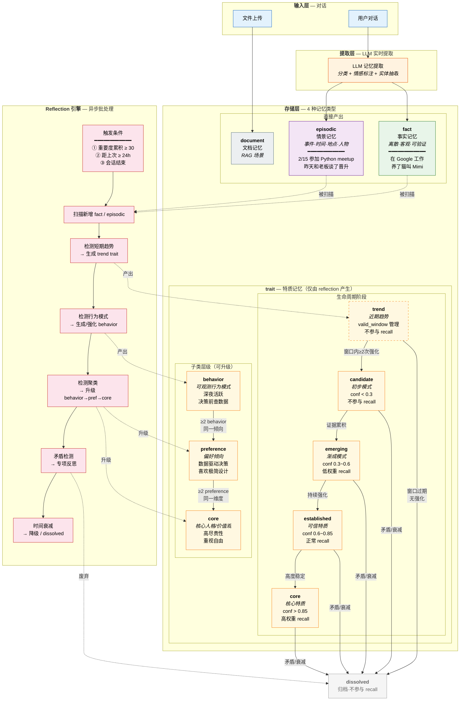

# 记忆分类与流转全景图

> 本文档为 `memory-classification-v2.md` 的可视化补充，便于快速理解记忆系统的完整流转过程。

---

## 1. 全景流转图



<details>
<summary>Mermaid 源码</summary>



</details>

---

## 2. 置信度与证据质量速查

```
证据质量分级                          置信度阶段
━━━━━━━━━━━━━━━━━━━━━              ━━━━━━━━━━━━━━━━━━━━━
A 级 (0.25) 跨情境一致                trend    [valid_window]  ── 不参与 recall
B 级 (0.20) 显式陈述                  candidate [< 0.3]       ── 不参与 recall
C 级 (0.15) 跨对话行为                emerging  [0.3 ~ 0.6]   ── 低权重
D 级 (0.05) 同对话/隐式               established [0.6 ~ 0.85] ── 正常
                                      core      [> 0.85]      ── 高权重优先

衰减公式（间隔效应）
━━━━━━━━━━━━━━━━━━━━━
effective_λ = base_λ / (1 + 0.1 × reinforcement_count)

base_λ:  behavior=0.005  preference=0.002  core=0.001
```

## 3. 矛盾处理流程

```
新证据与已有 trait 矛盾
         │
    矛盾比 > 0.3 ?
    ╱            ╲
  否              是
  │               │
置信度微降     触发专项 reflection
  │               │
  │          ┌────┼────┐
  │          │    │    │
  │        修正  分裂  废弃
  │          │    │    │
  │       更新   情境化  dissolved
  │      content 双面trait
  │          │    │
  └──────────┴────┘
```

## 4. 子类升级条件速查

```
fact/episodic ──────────────────────► behavior (trait)
  条件: ≥3 条呈现相同模式              初始 confidence = 0.4
  短期趋势: → trend (valid_window)
  有积累:   → candidate (conf=0.3)

behavior ──────────────────────────► preference
  条件: ≥2 behavior 同一倾向
        各自 confidence ≥ 0.5

preference ────────────────────────► core
  条件: ≥2 preference 同一人格维度
        各自 confidence ≥ 0.6

trend ─────────────────────────────► candidate
  条件: valid_window 内 ≥2 次强化

trend (过期) ──────────────────────► dissolved
  条件: valid_window 结束, 无强化
```

## 5. 情境标签体系

```
                    ┌─── work      (工作/专业)
                    ├─── personal  (私人/生活)
context 标签 ───────├─── social    (社交)
(behavior 层即附带) ├─── learning  (学习/成长)
                    ├─── general   (跨情境通用 — 升级加成最大)
                    └─── contextual(情境化双面 — 用 contexts 字段)
```
